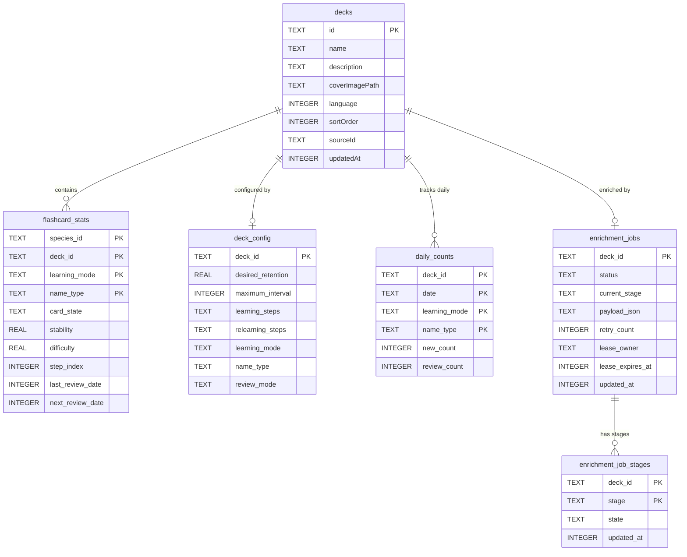

# Discere – Architecture Overview

## 1. What is Discere?

Discere is a **Flutter-based flashcard app** (Android + iOS) for learning biological species (primarily marine life). Users create or import decks of species, review flashcards using the FSRS 6 spaced-repetition algorithm, and track their learning progress. The app supports offline use, push notifications for due reviews, deck sharing via QR / JSON / text, and full DE/EN localization.

---

## 2. Architectural Style

> **Service-Oriented Layered Architecture with Provider-based DI**

The app uses a **3-layer service-repository architecture** wired via Provider-based dependency injection. It is not BLoC, not Clean Architecture, and not MVVM in a formal sense — though it shares traits with all three.

| Trait | In Discere |
|---|---|
| **Dependency Injection** | Manual constructor injection; wired in `lib/app/bootstrap_app.dart` and exposed via `MultiProvider`. |
| **State propagation** | `ChangeNotifier` + `Consumer` / `Provider.of`. Some services are `ChangeNotifier`, others are plain `Provider`. |
| **Data flow** | UI → Service → Repository → SQLite (via `DatabaseHelper`). |
| **Navigation** | Imperative `Navigator.push` with `MaterialPageRoute`. No declarative router. |
| **Separation of concerns** | Vertical separation by feature module (`shared`, `external`, `diagnostics`, `catalog`, `enrichment`, `learning`, `app`). Module dependency rules are enforced by architecture tests. |

---

## 3. Layer Diagram

```
┌────────────────────────────────────────────────────────────┐
│                         UI Layer                           │
│  app/  •  catalog/  •  learning/  •  enrichment/           │
│  (StatefulWidget + FutureBuilder + Consumer)               │
└────────────────────────┬───────────────────────────────────┘
                         │  Provider.of / Consumer
┌────────────────────────▼───────────────────────────────────┐
│                     Service Layer                          │
│                                                            │
│  learning/           enrichment/         catalog/          │
│  DecksService        EnrichmentService   WatchlistService  │
│  FlashcardService    INatEnrichment      SourceService     │
│  FsrsService         QueueService        LocalSpecies      │
│  DeckImportService   SpeciesPhotoService ImageService       │
│  ImportExportService INatName            SpeciesInat        │
│  RemoteDeckService   ResolutionService   MetadataService    │
│                      SpeciesMediaService                    │
│                      (enrichment→catalog composition point) │
│                                                            │
│  external/                        shared/                  │
│  INaturalistService               ImageService              │
│  WikipediaService                 NotificationService       │
│                                    LanguageService            │
│  diagnostics/                     UserPreferencesService     │
│  LocalDiagnostics                                            │
└────────────────────────┬───────────────────────────────────┘
                         │  direct method calls
┌────────────────────────▼───────────────────────────────────┐
│                  Persistence Layer                         │
│                                                            │
│  DatabaseHelper (static, dual-DB singleton)                │
│  learning/: DeckRepository, FlashcardStatRepository,        │
│    DeckConfigRepository, DailyCountRepository               │
│  catalog/: SpeciesRepository, SearchRepository,              │
│    SourceRepository, ExternalIdRepository,                  │
│    ExternalIdCacheRepository                                 │
│  enrichment/: INatPhotoCacheRepository,                      │
│    EnrichmentJobRepository, RuntimeCommonNameRepository      │
│  diagnostics/: LocalDiagnosticsRepository                    │
└────────────────────────┬───────────────────────────────────┘
                         │  sqflite
┌────────────────────────▼───────────────────────────────────┐
│                Data / Storage                              │
│                                                            │
│  discere_reference.db  (read-only, downloaded at runtime)  │
│  discere_user.db       (read-write, user data)             │
│  SharedPreferences     (language, favorites, watchlist,    │
│                         global default retention)          │
│  Local filesystem      (cached images, deck covers)        │
└────────────────────────────────────────────────────────────┘
```

---

## 4. Module Structure

The app is split into feature modules with explicit dependency rules.

### `shared/`
Dependency-free foundation. Generic infrastructure and cross-cutting helpers only — nothing domain-specific belongs here.
- `DatabaseHelper`, `ReferenceDatabaseProvisioner` (`persistence/`)
- `ImageService`, `LanguageService`, `UserPreferencesService`, `NotificationService`, `NetworkAvailability` (`service/`)
- `LoggingHttpClient`, `Logger` (`util/`)
- Generic UI primitives and utilities

### `external/`
HTTP clients for third-party APIs, one subfolder per provider. Depends only on `shared`; knows nothing about the app's domain slices.
- `INaturalistService` (`inaturalist/`)
- `WikipediaService` (`wikipedia/`)

### `diagnostics/`
Local, on-device diagnostics: structured event/telemetry recording and HTTP-failure logging.
- `LocalDiagnostics`, `LogDiagnosticsPersistence` (`service/`)
- `LocalDiagnosticsRepository` (`repository/`)

### `catalog/`
The reference catalog domain: species, taxonomy, search, source metadata, catalog UI.
- `SpeciesRepository`, `SearchRepository`, `SourceRepository`, `ExternalIdRepository`, `ExternalIdCacheRepository` (`repository/`)
- `LocalSpeciesImageService`, `SourceService`, `WatchlistService`, `SpeciesInatMetadataService` (`service/`)
- Species detail, taxonomy detail, watchlist pages

### `enrichment/`
Background job pipeline that fetches and caches species photos and common names from iNaturalist.
- `EnrichmentService`, `INatEnrichmentQueueService`, `EnrichmentJobExecutor`
- `SpeciesPhotoService`, `INatNameResolutionService`
- `SpeciesMediaService` — composition point over `catalog` (species/images), used by `learning` and `app`
- `INatPhotoCacheRepository`, `EnrichmentJobRepository`, `RuntimeCommonNameRepository` (`repository/`)

### `learning/`
Decks, flashcards, spaced repetition, import/export, and review flows.
- `DecksService`, `FlashcardService`, `FsrsService`
- `DeckImportService`, `ImportExportService`, `RemoteDeckService`
- `DeckRepository`, `FlashcardStatRepository`, `DeckConfigRepository`, `DailyCountRepository`
- Deck list, review session, edit deck, deck settings pages

### `app/`
Composition root and shell. Wires all modules together via `bootstrap_app.dart` + `wiring/`.
- `BootstrapApp`, `FlashcardApp`, `MainScreenPage`
- `SettingsPage`, `AboutPage`

### Module Dependency Rules

Enforced by `test/architecture/module_dependency_test.dart`:

```
shared        → (nothing — dependency-free foundation)
external      → shared
diagnostics   → shared
catalog       → external, shared
enrichment    → catalog, external, diagnostics, shared
learning      → catalog, enrichment, external, shared
app           → catalog, enrichment, external, diagnostics, learning, shared
```

---

## 5. Database Schema

### 5.1 User DB (`discere_user.db`) — ERD

Table definitions live as individual `CREATE TABLE` scripts under
`assets/sql/user_db/tables/` (and `assets/sql/user_db/fts/` for the one FTS
table), applied by `DatabaseHelper`.



Not shown above (no FK to `decks` — they're deduplicated/shared across decks
by `speciesId` or a cache key instead, see [`docs/enrichment.md`](./enrichment.md)
for how ownership across overlapping decks works):

| Table | Purpose |
|---|---|
| `enrichment_species_work` | Import-wide per-species enrichment state (`base_state`, `inat_primary_state`, `species_common_names_state`, `inat_backfill_state`), keyed by `species_id`, with an `owner_deck_id` + `deck_ids_json` for cross-deck dedupe |
| `enrichment_taxonomy_work` | Same idea one level up — deduplicated taxonomy (genus/family/order/class) common-name work, keyed by `work_key` (`rank + taxon_id`, fallback `rank + scientific_name`) |
| `inat_photo_cache` | Runtime-fetched iNaturalist photos, keyed by `(species_id, photo_url)` |
| `external_identifier_cache` | Runtime-discovered external IDs (e.g. iNaturalist taxon IDs not already in the reference DB's `entity_external_ids`), keyed by `(entity_id, provider)` |
| `runtime_common_names` | Runtime-fetched common names per entity/language, keyed by `entity_key` + `language_code`, with iNat ranking (`position`, `place_id`, `place_position`) |
| `runtime_common_name_search_documents` | Denormalized per-entity search document (one row per `entity_key`, one column per language) feeding the FTS table below |
| `runtime_common_name_search_fts` | FTS4 virtual table over `runtime_common_name_search_documents`, rebuilt whenever a row changes |
| `local_diagnostics_events` | Structured diagnostics/telemetry events (`category`, `event_type`, `subject_id`, `details_json`) |
| `local_diagnostics_network_failures` | HTTP failure log (`host`, `status_code`, `exception_type`, `retryable`) |

### 5.2 Reference DB (`discere_reference.db`) — Tables

Not bundled with the app — downloaded at runtime by `ReferenceDatabaseProvisioner`
(`lib/shared/persistence/reference_database_provisioner.dart`) once it outgrew
the app bundle (~400MB). See
[GitHub Issue #54](https://github.com/discere-app/discere/issues/54)
for the hosting/versioning design. Schema lives in `etl/core/sql/schema.sql`.

Taxonomy hierarchy: `classes ──< orders ──< families ──< genera ──< species ──< pictures`.

| Table | Contents |
|---|---|
| `species` | Core species entities (ID, genus FK, binomial name, morphology/ecology fields like `max_length_cm`, `habitat`, `vulnerability`) — soft-deleted via `status`/`deprecated_at` rather than removed, since user decks may reference them |
| `genera` / `families` / `orders` / `classes` | Taxonomy levels above species, each with a FK to its parent |
| `common_names` | Vernacular names for any taxonomic entity (species/genus/family/order/class), per language/country/source, replacing the old `common_name_*` columns that used to live directly on `species` etc. |
| `species_scientific_names` | Scientific-name synonyms/aliases per species with a `name_status` (`valid`/`synonym`/`misapplied name`/…) |
| `species_name_lookup` | Materialized `normalized_name → species_id` lookup, precomputed after import so name resolution doesn't need to disambiguate synonyms at query time |
| `taxonomy_traits` | Generic key/value traits/tags for any taxonomic entity (`entity_id`, `trait_key`, `trait_value_text`/`_num`/`_bool`), initially used for species habitat associations |
| `taxonomy_distribution_regions` | Normalized multi-value distribution/country data per taxonomic entity (presence, establishment status, abundance, …) |
| `pictures` | Bundled reference images; `license_key` + `is_usable` gate whether an image may legally be shown (only CC BY* licenses are usable per FishBase's terms) |
| `sources` | Upstream data source catalog (FishBase, SeaLifeBase, …) with citation/license/URL metadata for attribution |
| `entity_external_ids` | ETL-produced offline mapping from Discere entity IDs (species IDs or normalized taxonomy keys like `genus:barbus`) to external IDs (e.g. iNaturalist taxon IDs) |
| `locale_place_mappings` | BCP-47 locale → ISO country code → iNaturalist place-ID mapping, used to resolve regional common names (e.g. `de-CH` → `de` → `en` fallback) |
| `metadata` | Technical key/value import metadata (ETL version per source, enrichment timestamps) |

Plus one FTS4 virtual table per searchable table (`species_fts`, `common_names_fts`,
`genera_fts`, `families_fts`, `orders_fts`, `classes_fts`), rebuilt after every
plugin import.

---

## 6. FSRS 6 Algorithm

Discere implements **FSRS 6** (Free Spaced Repetition Scheduler v6), the sole scheduling algorithm.

### Card States

```
newCard → [initializeNextBatch] → learning
learning → [pass step] → learning | review
learning → [fail] → learning (reset steps)
review → [fail] → relearning
relearning → [pass step] → review
```

### Key Parameters (per deck, configurable)

| Parameter | Default | Description |
|---|---|---|
| `desiredRetention` | 0.9 (global) | Target recall probability |
| `maximumIntervalDays` | 36 500 | Hard cap on review interval |
| `learningSteps` | `[1m, 10m]` | Step durations for new cards |
| `relearningSteps` | `[10m]` | Step durations after failure |
| `newCardsPerDay` | 20 | Daily limit on newly initialized cards |
| `maxReviewsPerDay` | 200 | Daily cap on review-state cards (learning/relearning uncapped) |

### Global Default Retention

A global `defaultDesiredRetention` is stored in `SharedPreferences` (key: `default_desired_retention`, default 0.9) and editable on the Settings page. When a new deck is created or imported, a `deck_config` row is stamped immediately with the global default via the `DecksService.onDeckCreated` callback. Individual decks can override this via the Deck Settings page.

### Stability & Difficulty

FSRS 6 maintains two per-card parameters:
- **Stability** (`s`) — expected half-life of the memory trace; drives the next interval via `I = -log(R) / log(0.9) × s`
- **Difficulty** (`d`) — intrinsic hardness of the card; modulates stability updates on review

### 4.7 Enrichment Semantics

The post-import enrichment pipeline is intentionally **checkpointed and
terminal-state driven** — a species may only be marked complete for a stage
once it reached a real terminal outcome (data written successfully,
including the image actually landing on local storage, or an explicit
no-result marker), never just because a runner loop touched it once.

Full current-state walkthrough (stage list, terminal-state rule, runtime
model, components) moved to [`docs/enrichment.md`](./enrichment.md) — kept
out of this file so it doesn't drift out of sync as the pipeline keeps
changing.

### 4.8 Target Design: Import-Wide iNaturalist Enrichment (Roadmap)

The current queue is still deck-centric — one enrichment job per deck,
stage-local chunking, taxonomy common-name dedupe only within the current
chunk. A target design moving this to an import-wide, species-centric work
graph (keyed by `speciesId`/`taxon_id` instead of per-deck chunks), plus a
5-phase incremental migration plan for the existing codebase, is tracked in
[GitHub Issue #57](https://github.com/discere-app/discere/issues/57) rather than
here — it's forward-looking roadmap content, not the current implementation.

---

## 7. Key Runtime Flows

### 7.1 Dependency Wiring

`lib/app/bootstrap_app.dart` constructs all services and repositories, wires callback hooks (`onDeckCreated`, `onDeckDeleted`), and exposes everything via `MultiProvider`. Critical services are set up synchronously; deferred services (notifications, enrichment queue) are initialized after the first frame.

### 7.2 Review Session

1. `FlashcardService.getFlashCardsForReview(deckId)` queries `flashcard_stats` for due cards.
2. Daily review limit is applied: `learning`/`relearning` cards are always included; `review`-state cards are capped by `maxReviewsPerDay − todayReviewCount`.
3. `FlashcardService.reviewCard(speciesId, deckId, grade)` invokes `FsrsService.reviewCard()`, increments `daily_counts`, and reschedules push notifications. `grade` is one of four values: `Again` (forgot), `Hard` (difficult recall), `Good` (correct with effort), `Easy` (effortless recall).

### 7.3 Enrichment Queue

After a deck is created/imported/edited, `INatEnrichmentQueueService` schedules a checkpointed, per-stage enrichment run. See [`docs/enrichment.md`](./enrichment.md) for the full stage order, the terminal-state rule, and the runtime model (foreground-only, paused during active review sessions).

---

## 8. Testing

| Layer | Location | Tooling |
|---|---|---|
| Unit / service tests | `test/` | `flutter_test`, `mockito` |
| Architecture tests | `test/architecture/` | Custom import-path assertions |
| Integration tests | `integration_test/` | `flutter_test`, requires a device or emulator |

Mock files are generated by `mockito` via `build_runner` and co-located with the tests they serve (e.g. `test/service/mocks.dart`). After adding or changing `@GenerateMocks` annotations, re-run:

```sh
dart run build_runner build --delete-conflicting-outputs
```

CI runs on macOS via `.github/workflows/flutter_ci.yml`: `analyze` → unit tests → build APK + iOS.

---

## 9. Localization

ARB source files live in `lib/l10n/`. DE and EN are fully maintained; FR and ES exist as stubs.

| File | Language | Status |
|---|---|---|
| `app_de.arb` | German | Primary |
| `app_en.arb` | English | Primary |
| `app_fr.arb` | French | Stub |
| `app_es.arb` | Spanish | Stub |

Generated output (`lib/l10n/app_localizations*.dart`) is produced by `flutter gen-l10n` and must be re-run after any ARB change. The `LanguageService` (in `shared/`) exposes the active locale; UI code reads strings via `AppLocalizations.of(context)`.

---

## 10. Important Distinctions

| Pair | Distinction |
|---|---|
| `sources` vs `metadata` | `sources` describes a data source for UI/attribution; `metadata` tracks technical import/version state |
| `entity_external_ids` vs `external_identifier_cache` | `entity_external_ids` is ETL-produced and ships with the app; `external_identifier_cache` is discovered at runtime |
| `pictures` vs `inat_photo_cache` | `pictures` are bundled reference images from the ETL; `inat_photo_cache` contains runtime-fetched iNaturalist photos |
| `deck_config.desired_retention` vs `UserPreferencesService.defaultDesiredRetention` | Per-deck override stored in SQLite; global fallback stored in SharedPreferences |

---

## 11. Related Docs

- ETL overview: [`etl/README.md`](../etl/README.md)
- ETL ↔ Flutter integration: [`etl/FLUTTER_INTEGRATION.md`](../etl/FLUTTER_INTEGRATION.md)
- Reference-DB runtime download & hosting design: [GitHub Issue #54](https://github.com/discere-app/discere/issues/54)
- Architecture improvement tasks: [GitHub Issue #55](https://github.com/discere-app/discere/issues/55)
- iNaturalist-Enrichment — wie der Ablauf funktioniert (Ist-Zustand, Diagramm): [`docs/enrichment.md`](./enrichment.md)
- iNaturalist Enrichment — Architektur & offene Probleme: [GitHub Issue #56](https://github.com/discere-app/discere/issues/56)
- iNaturalist Enrichment — Target Design (Roadmap): [GitHub Issue #57](https://github.com/discere-app/discere/issues/57)
