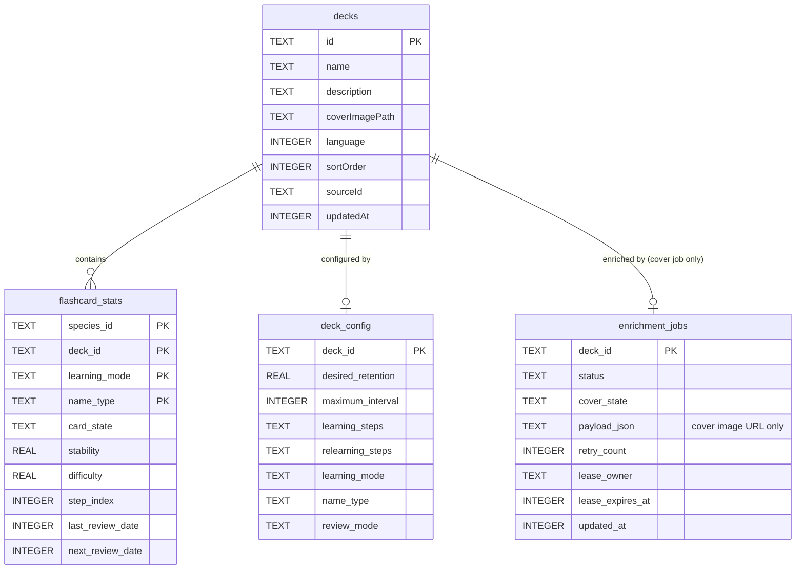

# Discere – Architecture Overview

## 1. What is Discere?

Discere is a **Flutter-based flashcard app** (Android + iOS) for learning biological species (primarily marine life). Users create or import decks of species, review flashcards using the FSRS 6 spaced-repetition algorithm, and track their learning progress. The app supports offline use, push notifications for due reviews, deck sharing via QR / JSON / text, and full DE/EN localization.

---

## 2. Architectural Style

> **Service-Oriented Layered Architecture with Provider-based DI**

The app uses a **3-layer service-repository architecture** wired via Provider-based dependency injection. It is not BLoC, not Clean Architecture, and not MVVM in a formal sense — though it shares traits with all three.

| Trait | In Discere |
|---|---|
| **Dependency Injection** | Manual constructor injection; wired in `lib/app/bootstrap/bootstrap_app.dart` and exposed via `MultiProvider`. |
| **State propagation** | `ChangeNotifier` + `Consumer` / `Provider.of`. Some services are `ChangeNotifier`, others are plain `Provider`. |
| **Data flow** | UI → Service → Repository → SQLite (via `DatabaseHelper`). |
| **Navigation** | Imperative `Navigator.push` with `MaterialPageRoute`. No declarative router. |
| **Separation of concerns** | Vertical separation by feature module (`shared`, `external`, `diagnostics`, `catalog`, `enrichment`, `learning`, `app`). Module dependency rules are enforced by architecture tests. |

**Widget organization.** Within a slice, pages follow `page` (StatefulWidget) → `presenter` → `view_model`: pure derived-state computation (dirty-tracking, validity checks, result merging, label/icon mapping) lives in a presenter class next to the widget, not inline in `State` — see `learning/decks/edit_deck_presenter.dart`, `learning/flashcard/deck_session_presenter.dart`, `catalog/search/search_results_presenter.dart`. Async orchestration coupled to `BuildContext`/`setState`/`mounted` (network calls, permission flows, navigation sequencing) stays directly in the State class regardless of size — that's not what a presenter is for (see `_BootstrapAppState` in `app/bootstrap/bootstrap_app.dart`, or `DeckPage`'s tutorial-scheduling methods). Once a page accumulates several large, self-contained private widgets — alternate full-screen states, dialogs, sections — each is split into its own file in the same directory as a public class, even if only used from one place: see `learning/flashcard/`, `learning/decks/edit/`, `app/bootstrap/`.

**Naming.** A class-name suffix from the table below states what the class *is* — how it is reached, or which layer it sits in — and a class that is something else does not take it:

| Suffix | Meaning | Examples |
|---|---|---|
| `Page` | Its own route, pushed with `Navigator.push`. One deliberate case: `SpeciesDetailPage` is the loaded full-screen state of `SpeciesDetailLoaderPage`, which is the route | `EditDeckPage`, `MainScreenPage` |
| `Tab` | Content of a tab container (`IndexedStack`, `TabBarView`); no route, no `Scaffold` of its own | `DecksTab`, `WatchlistTab`, `ImportTextTab` |
| `App` | Root widget passed to `runApp()`; wraps or replaces a `MaterialApp`, never routed | `BootstrapApp`, `FlashcardApp` |
| `Shell` | One alternative full-screen state of a state-machine root widget, picked in its `build()` | `BootstrapShell`, `ReferenceDbDownloadShell` |
| `Dialog` / `Sheet` | Shown via `showDialog` / a modal bottom sheet | `ActivateMoreCardsDialog`, `AddToDeckSheet` |
| `Section` | A self-contained block within a page, dialog or sheet — usually titled, often framed by a `SectionCard` | `SpeciesSummarySection`, `TaxonomyCommonNamesSection`, `LearningSettingsSection` |
| `Presenter` | Pure derived-state computation for a widget; not a widget | `EditDeckPresenter`, `DeckSessionPresenter` |
| `ViewModel` | Data carrier a presenter or widget renders | `DeckViewModel`, `TaxonomyDetailViewModel` |
| `Service` | Business logic, often a `ChangeNotifier` provided via Provider | `DecksService`, `TaxonomyService` |
| `Repository` | Raw SQL / persistence | `DeckRepository`, `SpeciesRepository` |
| `Api` | Client for a third-party API, under `external/` | `INatPhotoApi`, `WikipediaApi` |
| `Port` / `Adapter` | Inverts a cross-slice dependency: the lower slice declares the port, the wiring file implements it as an adapter (see "Dependency Injection" in `CLAUDE.md`) | `DeckSpeciesSnapshotPort`, `_DeckSpeciesSnapshotAdapter` |

Every other suffix is descriptive and free: `Card`/`Tile`/`Item` for list entries, `Info`/`Status`/`Result`/`Snapshot` for values, `Content` for the body a page, tab or other widget frames, `Header`, `Banner`, `Field`, `Button`, and so on. None of these says anything about routing or layering, so a rule choosing between `Card` and `Tile` would claim a precision the distinction does not have.

Widget key strings are snake_case, `<feature>_<element>`: `Key('edit_deck_save_button')`, `ValueKey('nav_watchlist')`.

**Feature ownership vs. slice-level flat dirs.** A file only belongs in a slice's flat `model/`/`repository/`/`service/` (e.g. `learning/service/`) if it's genuinely used by two or more feature folders within that slice, or by `app/` for composition — judge this from actual callers, not the file's name or type. If every real caller sits inside a single feature folder (including "called only by another file that already lives in that feature folder"), the file belongs inside that feature folder instead, even if it's a service or repository rather than a widget. This cuts both ways over a class's lifetime: a slice-level service that starts out shared can accrete feature-only methods as it grows, and should be split back apart once that happens — the shared remainder stays flat, the feature-only remainder moves into that feature's folder. Worked example: `learning/service/flashcard_service.dart` kept only the deck config/stat/notification surface genuinely shared with `decks/` and `app/`; the FSRS grading, due-card sourcing, and photo-gap tracking — used only from within `flashcard/` — moved to `learning/flashcard/service/flashcard_review_service.dart`.

Once a feature folder's own repository/service files start to accumulate (roughly 3+), split them into their own `service/`/`repository/` subfolders inside that feature folder, the same way `enrichment/queue/` and `enrichment/pipeline/` already do — see `learning/flashcard/service/` and `learning/flashcard/repository/`. Presenters/view_models/widgets stay flat in the feature folder itself either way; only the persistence/business-logic layers get pulled into subfolders.

---

## 3. Layer Diagram

```
┌────────────────────────────────────────────────────────────┐
│                         UI Layer                           │
│  app/  •  catalog/  •  learning/  •  enrichment/           │
│  (StatefulWidget + FutureBuilder + Consumer)               │
└────────────────────────┬───────────────────────────────────┘
                         │  Provider.of / Consumer
┌────────────────────────▼───────────────────────────────────┐
│                     Service Layer                          │
│                                                            │
│  learning/           enrichment/         catalog/          │
│  DecksService        INatEnrichment      WatchlistService  │
│  FlashcardService    QueueService        SourceService     │
│  DeckImportService   BaseWorker          LocalSpecies      │
│                      INatWorker          ImageService       │
│  learning/flashcard/ CoverJobRunner      SpeciesInat        │
│  DeckSessionService  SpeciesPhotoService MetadataService    │
│  FlashcardReview-                                            │
│    Service           SpeciesMediaService                    │
│  FsrsService         (enrichment→catalog composition point) │
│  MultipleChoice-                                             │
│    DistractorPool-                                           │
│    Service                                                   │
│                                                            │
│  external/                        shared/                  │
│  INatPhotoApi, INatSearchApi, …   ImageService              │
│  WikipediaApi                     NotificationService       │
│                                    LanguageService            │
│  diagnostics/                     UserPreferencesService     │
│  LocalDiagnostics                                            │
└────────────────────────┬───────────────────────────────────┘
                         │  direct method calls
┌────────────────────────▼───────────────────────────────────┐
│                  Persistence Layer                         │
│                                                            │
│  DatabaseHelper (static, dual-DB singleton)                │
│  learning/: DeckRepository, FlashcardStatRepository,        │
│    DeckConfigRepository                                     │
│  learning/flashcard/: SpeciesPhotoGapAckRepository           │
│  catalog/: SpeciesRepository, SearchRepository,              │
│    SourceRepository, ExternalIdRepository,                  │
│    ExternalIdCacheRepository                                 │
│  enrichment/: EnrichmentWorkRepository,                      │
│    EnrichmentJobRepository (cover job only),                 │
│    INatPhotoCacheRepository, RuntimeCommonNameRepository     │
│  diagnostics/: LocalDiagnosticsRepository                    │
└────────────────────────┬───────────────────────────────────┘
                         │  sqflite
┌────────────────────────▼───────────────────────────────────┐
│                Data / Storage                              │
│                                                            │
│  discere_reference.db  (read-only, downloaded at runtime)  │
│  discere_user.db       (read-write, user data)             │
│  SharedPreferences     (language, favorites, watchlist,    │
│                         global default retention)          │
│  Local filesystem      (cached images, deck covers)        │
└────────────────────────────────────────────────────────────┘
```

---

## 4. Module Structure

The app is split into feature modules with explicit dependency rules.

### `shared/`
Dependency-free foundation. Generic infrastructure and cross-cutting helpers only — nothing domain-specific belongs here.
- `DatabaseHelper`, `ReferenceDatabaseProvisioner` (`persistence/`); `closed_database_tolerance.dart` beside them is the one place a `DatabaseException` is caught — a database closed underneath a call is dropped quietly, every other database error propagates (ARCH-16)
- `ImageService`, `LanguageService`, `UserPreferencesService`, `NotificationService`, `NetworkAvailability` (`service/`)
- `LoggingHttpClient`, `Logger` (`util/`) — `Logger.warn`/`error` take an optional error and stack trace, written with the entry (stack cut to its first frames)
- Generic UI primitives and utilities

### `external/`
HTTP clients for third-party APIs, one subfolder per provider. Depends only on `shared`; knows nothing about the app's domain slices.
- `INatPhotoApi`, `INatCommonNameApi`, `INatSearchApi`, `INatMetadataApi` (`inaturalist/` — what consumers inject), over `INatApiClient`, `INatTaxonIdResolver` and `INatTaxonDetails`
- `WikipediaApi` (`wikipedia/`)

### `diagnostics/`
Local, on-device diagnostics: structured event/telemetry recording and HTTP-failure logging.
- `LocalDiagnostics`, `LogDiagnosticsPersistence` (`service/`)
- `LocalDiagnosticsRepository` (`repository/`)

### `catalog/`
The reference catalog domain: species, taxonomy, search, source metadata, catalog UI.
- `SpeciesRepository`, `SearchRepository`, `SourceRepository`, `ExternalIdRepository`, `ExternalIdCacheRepository` (`repository/`)
- `SourceService`, `WatchlistService`, `SpeciesSearchService` (`service/` — what more
  than one catalog feature uses); `SpeciesInatMetadataService` and
  `TaxonomyService` in their own feature's `service/`
- Species detail and taxonomy detail pages, watchlist tab

### `enrichment/`
Producer-consumer background pipeline that fetches and caches species photos
and common names from iNaturalist. Four feature-based subfolders — `queue/`
(deck-level job tracking/orchestration/UI-facing status), `pipeline/`
(species-level work queue + the two workers), `media/` (on-demand
species-image display, unrelated to the background queue — including
`LocalSpeciesImageService`, which resolves pictures to files on disk), `ports/` (shared
cross-cutting port interfaces). See [`docs/enrichment.md`](./enrichment.md)
for the full design.
- `INatEnrichmentQueueService`, `CoverJobRunner` (`queue/service/`) — entry
  point, lifecycle/foreground orchestration, plus the one remaining
  sequential job (deck cover image)
- `BaseWorker`, `INatWorker` (`pipeline/service/`) — the two independently-
  scheduled workers draining the shared species/taxonomy work queue
- `BaseImageEnrichmentService`, `INatPhotoEnrichmentService`,
  `SpeciesCommonNameEnrichmentService`, `TaxonomyCommonNameEnrichmentService`,
  `INatNameResolutionService` (`pipeline/service/`) — the actual iNaturalist/
  reference-image fetches the workers call
- `SpeciesMediaService` (`media/service/`) — composition point over `catalog`
  (species/images), used by `learning` and `app`. Its two bulk entry points
  share one implementation and differ only in whether missing images are
  downloaded: `resolveAllFromCache` renders from what is on disk,
  `resolveAllWithDownload` fetches what is missing. Both read the two databases
  in one bundled pass, so the number of queries does not grow with the number of
  species, and both answer in the order the caller asked for rather than the
  taxonomic order the species load returns — which is what lets a list render
  the cached pass and adopt the downloaded one later without resorting itself.
  The external (iNaturalist) downloads inside the second pass are strictly
  serial, as that host's rate limit requires; nothing on screen waits for that
  call (see §7.3), so serialising it costs no screen time.
  `resolveSpeciesFromCache` is the cached pass for a caller that already holds
  its species — the edit-deck page's species list (`EditDeckSpeciesList`) — and
  skips the species load: one photo-cache read and one path resolution, in the
  order of the list it was handed.
  `findSpeciesWithoutLocalImage` answers the narrower "does this species have a
  picture on disk at all" from the candidate URLs alone, without that taxonomy
  load.
- `EnrichmentWorkRepository` (species/taxonomy queue), `EnrichmentJobRepository`
  (cover job only), `INatPhotoCacheRepository`, `RuntimeCommonNameRepository`
  (`pipeline/repository/` and `queue/repository/`)
- `EnrichmentCapability`, `EnrichmentWorkState`, `DeckEnrichmentProjection`
  (`model/`) and `EnrichmentFailureClassifier` (`service/`) — the types both
  `queue/` and `pipeline/` need, kept at slice level so `pipeline/` never has
  to import from `queue/`. The two enums carry an explicit `wireName`, so the
  strings in the queue tables are written in exactly one place.

### `learning/`
Decks, flashcards, spaced repetition, import/export, and review flows.
- `DecksService`, `FlashcardService` (deck config/stat/notification surface
  shared with `decks/` and `app/`), `DeckImportService` (`service/`) —
  genuinely multi-feature, so these stay at the slice level
- `DeckRepository`, `FlashcardStatRepository`, `DeckConfigRepository`
  (`repository/`)
- `decks/` (deck list, create, edit — `edit/` and `add_to_deck/`
  subfolders), `import/` (online-deck import, plus JSON, QR payload and
  species list from scan, paste or file — told apart by
  `ImportTextRecognizer`; own `RemoteDeckService` in `import/`), `share/`
  (QR/JSON/species-list export, own `DeckExportService` in `share/`),
  `favorites/`
- `flashcard/` — review session UI (`DeckPage`, `FlashcardWidget` and its
  front/back states), plus its own `service/` (`DeckSessionService`
  orchestrating a session, `FlashcardReviewService` for FSRS
  grading/due-card sourcing/photo-gap tracking, `FsrsService` the algorithm,
  `MultipleChoiceDistractorPoolService` for taxonomy-aware multiple-choice
  distractors, `TaxonomyDistractorPools` holding one session's pools, built
  per card scope on first use) and `repository/`
  (`SpeciesPhotoGapAckRepository`) — none of
  these are used outside `flashcard/`, so they live there rather than in the
  slice-level `service/`/`repository/`

### `app/`
Composition root and shell. Wires all modules together via `bootstrap/bootstrap_app.dart` + `wiring/`.
- `FlashcardApp`, `MainScreenPage`, `SettingsPage`, `AboutPage`
- `bootstrap/` — `BootstrapApp` (the pre-init state machine, run by `main.dart` before `FlashcardApp` exists) plus its full-screen states (loading, generic error, reference-DB download confirm/progress/error/declined), one widget per file; `installUncaughtErrorLogging`, which `main.dart` calls first, so every error nothing else handled — a framework error or a failed future nobody awaits — reaches the diagnostics log under the scope `UncaughtError`

### Module Dependency Rules

Enforced by ARCH-01 (see CLAUDE.md's architecture-rule table for the
full list of rules and their tests):

```
shared        → (nothing — dependency-free foundation)
external      → shared
diagnostics   → shared
catalog       → external, shared
enrichment    → catalog, external, diagnostics, shared
learning      → catalog, enrichment, external, shared
app           → catalog, enrichment, external, diagnostics, learning, shared
```

---

## 5. Database Schema

### 5.1 User DB (`discere_user.db`) — ERD

Table definitions live as individual `CREATE TABLE` scripts under
`assets/sql/user_db/tables/` (and `assets/sql/user_db/fts/` for the one FTS
table), listed in `UserDbSchema.schemaAssetPaths`.

Those assets are the single source of truth for the current shape, and
`SchemaReconciler` is what applies it: it creates missing tables, adds missing
columns, and builds missing indexes, in that order — an index often covers a
column the same run just added. Both entry points go through it, so a fresh
install and an upgraded database cannot end up different: `UserDbSchema.create`
is the case where every table is missing, and `UserDbSchema.upgrade` runs it
after the migration ladder.

The split with the ladder is deliberate. A migration describes the schema *as
it was* at its own version and may never be updated to match today's assets
(ARCH-13), so no migration can be the thing that guarantees the current shape.
Reconciliation states it instead, and derives the work from the assets rather
than from a hand-maintained repair list — a list has to be extended in a second
place by whoever adds a column, with nothing checking that they did.

Three boundaries are worth knowing:

- **Structure only, never data.** A missing table or column is unambiguous;
  data is not. Reconciliation cannot tell a failed backfill from a legitimately
  empty column, and a wrongly filled review stat shifts a card's due date
  silently, days before anyone notices. A missing column, by contrast, throws
  on the next query that names it.
- **Additive only.** A column the assets no longer name stays, a changed type
  or default is not applied to a column that already exists, and an index with
  the right name over the wrong columns stays wrong — `CREATE INDEX IF NOT
  EXISTS` matches on the name. Correcting any of those means rebuilding the
  table and deciding what happens to its rows, which is a migration's job.
- **Not on every open.** The case that would need that is a database arriving
  already at the current version without ever running the ladder — a restore,
  or a file copied between devices. There is no such path today; adding one
  (issue #204) should call `SchemaReconciler.reconcile` itself rather than
  making every app start pay for a check that cannot currently find anything.

A column added to an asset must be nullable or carry a default, or no existing
database can ever receive it — SQLite cannot `ALTER TABLE … ADD COLUMN` a
`NOT NULL` column with no value for the rows already there. Reconciliation
raises a `StateError` naming the column rather than leaving it missing, and
because that runs inside `onUpgrade` it fails the database open: the app shows
the bootstrap error screen instead of starting. That is deliberate — a missing
column would otherwise fail every query naming it, at a place with nothing to
point at — but it means such a column is a release-blocking mistake, not a
degraded feature.

`test/shared/persistence/schema/user_db_schema_assets_test.dart` holds the
columns already in that position as a ratchet, so a new one is visible. They
are all reachable only on tables that already have them. `runtime_common_names.
name` is the one that needs saying why: it replaced a `names` column with no
migration behind it, and no installation is known to predate that change —
migration v19 drops the old shape anyway, so the guarantee rests on code rather
than on release history nobody can check later.


```mermaid
erDiagram
    decks {
        TEXT id PK
        TEXT name
        TEXT description
        TEXT coverImagePath
        INTEGER language
        INTEGER sortOrder
        TEXT sourceId
        INTEGER updatedAt
    }

    flashcard_stats {
        TEXT species_id PK
        TEXT deck_id PK
        TEXT learning_mode PK
        TEXT name_type PK
        TEXT card_state
        REAL stability
        REAL difficulty
        INTEGER step_index
        INTEGER last_review_date
        INTEGER next_review_date
    }

    deck_config {
        TEXT deck_id PK
        REAL desired_retention
        INTEGER maximum_interval
        TEXT learning_steps
        TEXT relearning_steps
        TEXT learning_mode
        TEXT name_type
        TEXT review_mode
    }

    enrichment_jobs {
        TEXT deck_id PK
        TEXT status
        TEXT cover_state
        TEXT payload_json "cover image URL only"
        INTEGER retry_count
        TEXT lease_owner
        INTEGER lease_expires_at
        INTEGER updated_at
    }

    decks ||--o{ flashcard_stats : "contains"
    decks ||--o| deck_config : "configured by"
    decks ||--o| enrichment_jobs : "enriched by (cover job only)"
```

`enrichment_jobs` tracks only the one remaining sequential job (the deck's
cover-image download), whose progress is the `cover_state` column;
species/taxonomy enrichment lives in the reactive queue tables below. See
[`docs/enrichment.md`](./enrichment.md) for the full design.

Not shown above (no FK to `decks` — they're deduplicated/shared across decks
by `speciesId` or a cache key instead, see [`docs/enrichment.md`](./enrichment.md)
for how ownership across overlapping decks works):

| Table | Purpose |
|---|---|
| `enrichment_species_work` | Cross-deck species identity/ownership row + OR'd-across-decks consent flags (`wants_inat_photos`, `wants_common_names`), keyed by `species_id`, with `owner_deck_id` for dedupe tie-breaking |
| `enrichment_species_capability_state` | The actual species-level work queue `BaseWorker`/`INatWorker` drain — one row per `(species_id, capability)` (`base`/`inatPrimary`/`speciesCommonNames`/`inatBackfill`), with `state`/`priority_tier`/retry bookkeeping. Permanent cross-deck dedup cache — not deleted when a deck is deleted |
| `enrichment_species_deck_membership` | Junction table: which decks currently reference which species. Pruned once a species' work is fully terminal for every deck wanting it; unrelated to the permanent cache above |
| `enrichment_taxonomy_work` | Same idea one level up — deduplicated taxonomy (genus/family/order/class) common-name work, keyed by `work_key` (`rank + taxon_id`, fallback `rank + scientific_name`) |
| `enrichment_unresolved_names` | Species names submitted at import or deck creation that couldn't be resolved against the reference DB yet, queued for iNat-based resolution (`INatWorker`'s lowest-priority queue item) |
| `inat_photo_cache` | Runtime-fetched iNaturalist photos, keyed by `(species_id, photo_url)` |
| `external_identifier_cache` | Runtime-discovered external IDs (e.g. iNaturalist taxon IDs not already in the reference DB's `entity_external_ids`), keyed by `(entity_id, provider)` |
| `runtime_common_names` | Runtime-fetched common names per entity/language, keyed by `entity_key` + `language_code`, with iNat ranking (`position`, `place_id`, `place_position`) |
| `runtime_common_name_search_documents` | Denormalized per-entity search document (one row per `entity_key`, one column per language) feeding the FTS table below |
| `runtime_common_name_search_fts` | FTS4 virtual table over `runtime_common_name_search_documents`, rebuilt whenever a row changes |
| `local_diagnostics_events` | Structured diagnostics/telemetry events (`category`, `event_type`, `subject_id`, `details_json`) |
| `local_diagnostics_network_failures` | HTTP failure log (`host`, `status_code`, `exception_type`, `retryable`) |

### 5.2 Reference DB (`discere_reference.db`) — Tables

Not bundled with the app — downloaded at runtime by `ReferenceDatabaseProvisioner`
(`lib/shared/persistence/reference_database_provisioner.dart`) once it outgrew
the app bundle (~400MB). See
[GitHub Issue #54](https://github.com/discere-app/discere/issues/54)
for the hosting/versioning design. Schema lives in `etl/core/sql/schema.sql`.

Taxonomy hierarchy: `classes ──< orders ──< families ──< genera ──< species ──< pictures`.

| Table | Contents |
|---|---|
| `species` | Core species entities (ID, genus FK, binomial name, morphology/ecology fields like `max_length_cm`, `habitat`, `vulnerability`) — soft-deleted via `status`/`deprecated_at` rather than removed, since user decks may reference them |
| `genera` / `families` / `orders` / `classes` | Taxonomy levels above species, each with a FK to its parent |
| `common_names` | Vernacular names for any taxonomic entity (species/genus/family/order/class), per language/country/source, replacing the old `common_name_*` columns that used to live directly on `species` etc. |
| `species_scientific_names` | Scientific-name synonyms/aliases per species with a `name_status` (`valid`/`synonym`/`misapplied name`/…) |
| `species_name_lookup` | Materialized `normalized_name → species_id` lookup, precomputed after import so name resolution doesn't need to disambiguate synonyms at query time |
| `taxonomy_traits` | Generic key/value traits/tags for any taxonomic entity (`entity_id`, `trait_key`, `trait_value_text`/`_num`/`_bool`), initially used for species habitat associations |
| `taxonomy_distribution_regions` | Normalized multi-value distribution/country data per taxonomic entity (presence, establishment status, abundance, …) |
| `pictures` | Bundled reference images; `license_key` + `is_usable` gate whether an image may legally be shown (only CC BY* licenses are usable per FishBase's terms) |
| `sources` | Upstream data source catalog (FishBase, SeaLifeBase, …) with citation/license/URL metadata for attribution |
| `entity_external_ids` | ETL-produced offline mapping from Discere entity IDs (species IDs or normalized taxonomy keys like `genus:barbus`) to external IDs (e.g. iNaturalist taxon IDs) |
| `locale_place_mappings` | BCP-47 locale → ISO country code → iNaturalist place-ID mapping, used to resolve regional common names (e.g. `de-CH` → `de` → `en` fallback) |
| `metadata` | Technical key/value import metadata (ETL version per source, enrichment timestamps) |

Plus one FTS4 virtual table per searchable table (`species_fts`, `common_names_fts`,
`genera_fts`, `families_fts`, `orders_fts`, `classes_fts`), rebuilt after every
plugin import.

---

## 6. FSRS 6 Algorithm

Discere implements **FSRS 6** (Free Spaced Repetition Scheduler v6), the sole scheduling algorithm.

### Card States

```
newCard → [initializeNextBatch] → learning
learning → [pass step] → learning | review
learning → [fail] → learning (reset steps)
review → [fail] → relearning
relearning → [pass step] → review
```

### Key Parameters (per deck, configurable)

| Parameter | Default | Description |
|---|---|---|
| `desiredRetention` | 0.9 (global) | Target recall probability |
| `maximumIntervalDays` | 36 500 | Hard cap on review interval |
| `learningSteps` | `[1m, 10m]` | Step durations for new cards |
| `relearningSteps` | `[10m]` | Step durations after failure |
| `newCardsPerDay` | 20 | Daily limit on newly initialized cards |
| `maxReviewsPerDay` | 200 | Daily cap on review-state cards (learning/relearning uncapped) |

### Global Default Retention

A global `defaultDesiredRetention` is stored in `SharedPreferences` (key: `default_desired_retention`, default 0.9) and editable on the Settings page. When a new deck is created or imported, a `deck_config` row is stamped immediately with the global default via the `DecksService.onDeckCreated` callback. Individual decks can override this via the Deck Settings page.

### Stability & Difficulty

FSRS 6 maintains two per-card parameters:
- **Stability** (`s`) — expected half-life of the memory trace; drives the next interval via `I = -log(R) / log(0.9) × s`
- **Difficulty** (`d`) — intrinsic hardness of the card; modulates stability updates on review

### 4.7 Enrichment Semantics

The post-import enrichment pipeline is an **import-wide, species-centric
producer-consumer queue**, not one sequential job per deck — two
independently-scheduled workers (`BaseWorker` for reference images,
`INatWorker` as the single rate-limited iNaturalist consumer) share a
persisted priority queue keyed by `speciesId`, deduplicated across every deck
referencing a given species rather than chunked per-deck. It is intentionally
**terminal-state driven**: a species may only be marked complete for a
capability once it reached a real terminal outcome (data written
successfully, including the image actually landing on local storage, or an
explicit no-result marker), never just because a worker loop touched it once.

Full current-state walkthrough (worker responsibilities, retry/resume state
machine, consent model, cross-deck dedup, runtime model, diagrams) lives in
[`docs/enrichment.md`](./enrichment.md) — kept out of this file so it doesn't
drift out of sync as the pipeline keeps changing.

---

## 7. Key Runtime Flows

### 7.1 Dependency Wiring

`lib/app/bootstrap/bootstrap_app.dart` constructs all services and repositories, wires callback hooks (`onDeckCreated`, `onDeckDeleted`), and exposes everything via `MultiProvider`. Critical services are set up synchronously; deferred services (notifications, enrichment queue) are initialized after the first frame.

### 7.2 Review Session

1. `FlashcardReviewService.getFlashCardsForReview(deckId)` queries
   `flashcard_stats` for due cards, then hands the whole species set to
   `SpeciesMediaService.resolveAllFromCache` — one species load, one
   photo-cache read and one path resolution per storage directory for the
   entire session, so the time to the first card does not depend on how many
   cards are due.
2. `FlashcardReviewService.getUnacknowledgedPhotoGaps(deckId, speciesIds)`
   runs alongside that first card, and only once a deck's image stages are
   complete — before that, "no local image" means "not downloaded yet" rather
   than "there is none". It answers in two phases: which species lack an image
   is decided from the candidate URLs alone
   (`SpeciesMediaService.findSpeciesWithoutLocalImage` — reference pictures,
   iNaturalist cache rows, one path resolution), and only the gaps are then
   loaded as full cards, since the taxonomy load exists here for one thing: the
   display name the gaps dialog shows.
3. `FlashcardReviewService.reviewCard(speciesId, deckId, grade)` invokes
   `FsrsService.reviewCard()`. `grade` is one of four values: `Again`
   (forgot), `Hard` (difficult recall), `Good` (correct with effort), `Easy`
   (effortless recall). Notifications are rescheduled once when the session
   ends, not per graded card.

### 7.3 Watchlist Load

`WatchlistTab` loads in two passes, because the two cost orders of magnitude
apart: `SpeciesMediaService.resolveAllFromCache` answers in a few queries from
what is already on disk, while `resolveAllWithDownload` is bounded by the
network and by iNaturalist's serialised downloads. The list renders from the
first and adopts the second whenever it arrives; both return the same species in
the same order, so adopting the second only fills in images rather than
resorting the list.

Every load carries a generation, and a result is applied only if it is still the
one the tab is showing. Removing a species invalidates the in-flight load at
that moment rather than waiting for the rebuild a frame later — otherwise a
download started for the longer list can land in between and put the just-removed
entry back, on top of a `Dismissible` that has already been dismissed. A failed
download leaves the cached list standing instead of replacing it with an error:
it is a usable watchlist, just without some pictures.

### 7.4 Enrichment Queue

After a deck is created/imported/edited, `INatEnrichmentQueueService` seeds
species-level work into the shared queue, and `BaseWorker`/`INatWorker` start
draining it concurrently. See [`docs/enrichment.md`](./enrichment.md) for the
full architecture, the retry/resume state machine, the consent model, and
the runtime model (foreground-only, paused during active review sessions).

---

## 8. Testing

| Layer | Location | Tooling |
|---|---|---|
| Unit / service tests | `test/` | `flutter_test`, `mockito` |
| Architecture tests | `test/architecture/` | One file per rule, each printing its ARCH-ID; see CLAUDE.md |
| Integration tests | `integration_test/` | `flutter_test`, requires a device or emulator |

Mock files are generated by `mockito` via `build_runner` and co-located with the tests they serve (e.g. `test/service/mocks.dart`). After adding or changing `@GenerateMocks` annotations, re-run:

```sh
dart run build_runner build
```

CI runs on macOS via `.github/workflows/flutter_ci.yml`: `analyze` → unit tests → build APK + iOS.

---

## 9. Localization

ARB source files live in `lib/l10n/`. DE and EN are fully maintained; FR and ES exist as stubs.

| File | Language | Status |
|---|---|---|
| `app_de.arb` | German | Primary |
| `app_en.arb` | English | Primary |
| `app_fr.arb` | French | Stub |
| `app_es.arb` | Spanish | Stub |

Generated output (`lib/l10n/app_localizations*.dart`) is produced by `flutter gen-l10n` and must be re-run after any ARB change. The `LanguageService` (in `shared/`) exposes the active locale; UI code reads strings via `AppLocalizations.of(context)`.

---

## 10. Important Distinctions

| Pair | Distinction |
|---|---|
| `sources` vs `metadata` | `sources` describes a data source for UI/attribution; `metadata` tracks technical import/version state |
| `entity_external_ids` vs `external_identifier_cache` | `entity_external_ids` is ETL-produced and ships with the app; `external_identifier_cache` is discovered at runtime |
| `pictures` vs `inat_photo_cache` | `pictures` are bundled reference images from the ETL; `inat_photo_cache` contains runtime-fetched iNaturalist photos |
| `deck_config.desired_retention` vs `UserPreferencesService.defaultDesiredRetention` | Per-deck override stored in SQLite; global fallback stored in SharedPreferences |

---

## 11. Related Docs

- ETL overview: [`etl/README.md`](../etl/README.md)
- ETL ↔ Flutter integration: [`etl/FLUTTER_INTEGRATION.md`](../etl/FLUTTER_INTEGRATION.md)
- Reference-DB runtime download & hosting design: [GitHub Issue #54](https://github.com/discere-app/discere/issues/54)
- Architecture improvement tasks: [GitHub Issue #55](https://github.com/discere-app/discere/issues/55)
- iNaturalist-Enrichment — wie der Ablauf funktioniert (Ist-Zustand, Diagramme): [`docs/enrichment.md`](./enrichment.md)
- iNaturalist Enrichment — Design-Diskussion & Hintergrund: [GitHub Issue #56](https://github.com/discere-app/discere/issues/56), [GitHub Issue #57](https://github.com/discere-app/discere/issues/57)
