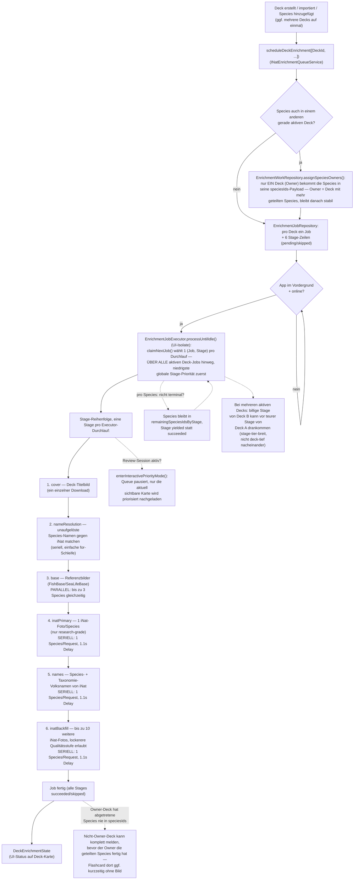

# iNaturalist-Enrichment — wie der Ablauf funktioniert

**Kategorie:** Architektur-Referenz (Ist-Zustand) · **Status:** Aktuell (Stand 2026-07-22)

Kurzreferenz für den aktuellen Enrichment-Ablauf, nachdem in letzter Zeit
mehrere Änderungen daran gemacht wurden (Terminal-State-Fix für
Bild-Downloads, Foreground-only-Umstellung). Für offene Probleme/Ideen siehe
[GitHub Issue #56](https://github.com/discere-app/discere/issues/56),
für die geplante Import-weite Umstellung siehe
[GitHub Issue #57](https://github.com/discere-app/discere/issues/57).

## Wozu

Nach Erstellen/Importieren eines Decks (oder Hinzufügen von Species zu einem
bestehenden Deck) reichert Discere jede Species im Hintergrund an:
Referenzbilder aus der ETL-Datenbank herunterladen, zusätzliche Fotos und
mehrsprachige Volksnamen von iNaturalist nachladen. Ziel: möglichst schnell
mindestens ein Bild pro Species, ohne die App zu blockieren.

## Ablauf

## Die 6 Stages im Detail

Reihenfolge ist fix (`EnrichmentJobRepository._nextRunnableStage`), eine
Stage muss abgeschlossen sein, bevor die nächste startet. `cover` und
`nameResolution` werden übersprungen (`skipped`), wenn es nichts zu tun gibt
(kein Cover-URL bzw. keine unaufgelösten Namen).

| # | Stage | Was passiert | Bilder-Quelle | Nebenläufigkeit |
|---|---|---|---|---|
| 1 | `cover` | Lädt das Deck-Titelbild herunter, falls beim Import eine URL mitgegeben wurde. | — | ein einzelner Download, n/a |
| 2 | `nameResolution` | Species, die beim Import nur als Freitext-Name vorlagen (keine FishBase/SLB-ID), werden über iNat aufgelöst und dem Deck hinzugefügt. | — | **seriell** — einfache `for`-Schleife, keine Concurrency-Utility |
| 3 | `base` | Referenzbilder aus der ETL-Datenbank (`pictures`-Tabelle, `is_usable = 1`) herunterladen. | `reference_images/` | **parallel** — bis zu 3 Species gleichzeitig (`_maxConcurrentINatSpeciesFetches`) |
| 4 | `inatPrimary` | Ein Foto pro Species von iNaturalist — nur `quality_grade: research` (von der Community verifiziert). | `external_images/` | **seriell** — 1 Species/Request, 1.1s Delay (`backgroundINatMaxConcurrent`) |
| 5 | `names` | Species- und Taxonomie-Volksnamen (Genus/Familie/Ordnung/Klasse) von iNat, mehrsprachig. | — | **seriell** — 1 Species/Request, 1.1s Delay, auch für den Taxonomie-Teil |
| 6 | `inatBackfill` | Für Species mit weniger als 10 gecachten Fotos: bis zu 10 weitere Fotos nachladen, dabei auch niedrigere Qualitätsstufen (`needs_id`/`casual`) erlaubt (`allowTier3Fallback`). | `external_images/` | **seriell** — 1 Species/Request, 1.1s Delay |

Nebenläufigkeit ist bewusst nach Quelle gesplittet, nicht pauschal: **nur
`base`** läuft parallel, weil es keine iNat-Requests sind (reine
FishBase/SeaLifeBase-Downloads). **Alle vier iNat-Stages** (`nameResolution`,
`inatPrimary`, `names`, `inatBackfill`) laufen strikt seriell — iNat reagiert
empfindlich auf Burst-Traffic, parallele Requests brachten in der Praxis
kaum Durchsatzgewinn, aber spürbar mehr Rate-Limit-Fehler und Retries. Die
drei throttled Stages (`inatPrimary`/`names`/`inatBackfill`) erzwingen das
über `backgroundINatMaxConcurrent = 1` + `backgroundINatRequestSpacing =
1.1s`; `nameResolution` ist ohnehin nur eine simple sequenzielle Schleife
ohne jede Concurrency-Utility.

**Bekannte Lücke (siehe unten):** Species, für die Stage 4 (`inatPrimary`)
null Fotos fand (nicht bloß wenige, sondern exakt null), werden von Stage 6
komplett übersprungen (`_buildBackfillINatPhotoQueue`) — sie bekommen nie die
Chance auf die lockerere Qualitätsstufe. Betroffen z. B. `Porcellanella
triloba`: iNat hat dafür nur `casual`/`needs_id`-Fotos, keine
`research`-grade — die Species bleibt deshalb dauerhaft ohne Bild, obwohl
iNat welche hätte. Noch nicht entschieden, ob das Verhalten korrigiert werden
soll (bewusste Qualitätsgrenze vs. Bug) — siehe Notiz in
[GitHub Issue #56](https://github.com/discere-app/discere/issues/56).

## Die Terminal-State-Regel

Der Kern-Grundsatz der ganzen Pipeline: **eine Species gilt erst als fertig
für eine Stage, wenn sie einen echten Endzustand erreicht hat** — nicht
schon, wenn die Stage sie nur einmal angefasst hat.

Terminal heißt:
- die Daten wurden tatsächlich erfolgreich geschrieben (inkl. Bild als
  lokale Datei — siehe Bugfix unten), **oder**
- ein expliziter No-Result-Marker wurde geschrieben (`inat_photo_cache`
  speichert `__empty__`, `runtime_common_names` einen No-Result-Marker,
  wenn iNat den Taxon zwar auflösen konnte, aber nichts liefert)

Ist eine Species noch nicht terminal, bleibt sie in
`remainingSpeciesIdsByStage` und wird beim nächsten Executor-Durchlauf erneut
versucht — die Stage wird als `yielded` statt `succeeded` markiert.

**Kürzlich behobener Bug:** Bis vor kurzem galt eine Species schon als
terminal, sobald iNat eine Foto-*URL* geliefert hatte — unabhängig davon, ob
der anschließende Datei-Download tatsächlich klappte (`ImageService`
verschluckt einzelne Download-Fehler und gibt nur `null` zurück, statt zu
werfen). Ergebnis: `imageStagesComplete` sprang auf `true`, obwohl für
manche Species nie eine lokale Bilddatei ankam — die Flashcard erschien dann
ohne Bild, meist erst in einer *späteren* Lern-Session (die erste hatte die
Karte noch versteckt, weil `imageStagesComplete` da noch `false` war). Fix:
`onSpeciesCompleted` wird jetzt erst aufgerufen, wenn der Download
tatsächlich eine lokale Datei erzeugt hat (`lib/enrichment/service/enrichment_service.dart`,
alle drei Foto-Download-Pfade). Regressionstests dazu in
`test/enrichment/service/enrichment_service_test.dart`.

## Laufzeitmodell

- **Läuft komplett in der UI-Isolate**, kein separater Background-Isolate
  mehr. Der frühere Workmanager-Pfad wurde entfernt, weil er mit der
  UI-Isolate um den SQLite-Writer-Lock der User-DB konkurrierte
  (`lib/app/background/inat_background_task.dart` existiert nur noch als
  No-Op-Callback für Workmanager-Wakeups von alten App-Versionen).
- Damit der Android-Prozess bei Bildschirm aus nicht vom OS beendet wird,
  hält `EnrichmentForegroundServiceKeeper` einen echten Android-Foreground-
  Service mit Notification am Laufen, solange Jobs offen sind.
- Getriggert wird der Executor-Loop (`processUntilIdle`) bei
  `scheduleDeckEnrichment()` (Deck erstellt/importiert/bearbeitet) und immer
  wieder, wenn die App in den Vordergrund kommt (`AppLifecycleState.resumed`).
  Läuft nur, wenn online (`NetworkAvailability`).
- **Pausiert während einer aktiven Lern-Session:** `DeckPage` ruft beim
  Öffnen `enterInteractivePriorityMode()` auf — die Queue hält an, damit sie
  nicht mit dem gezielten Nachladen der gerade sichtbaren Karte
  (`ensureSingleImageForSpecies`) um Bandbreite/DB-Zugriff konkurriert.
- **Host-Cooldown/Retry:** `HostCooldownTracker` erkennt wiederholte
  Fehler/Rate-Limits pro Host und pausiert weitere Requests dorthin
  temporär. Stage-Retries eskalieren mit Backoff bis zu einem Limit
  (`_maxTemporaryRetries`), danach `failedPermanent`.

## Mehrere Decks gleichzeitig

`scheduleDeckEnrichment()` nimmt eine **Liste** von Deck-IDs entgegen — z. B.
wenn beim Import mehrere Decks auf einmal angelegt werden. Es gibt aber
weiterhin **einen Job pro Deck**, keinen gemeinsamen Job. Der Ownership- und
der Priorisierungs-Schritt sind oben bereits im Hauptdiagramm eingezeichnet
(Verzweigung bei `scheduleDeckEnrichment` bzw. der Hinweis an
`EnrichmentJobExecutor`) — hier die Details dazu:

**1. Species-Ownership-Dedup** (`EnrichmentWorkRepository.assignSpeciesOwners`,
Tabelle `enrichment_species_work`) — verhindert, dass dieselbe Species von
zwei gleichzeitig laufenden Deck-Jobs unabhängig voneinander bei iNat
angefragt wird:
- Eine Species, die in mehreren gerade geplanten (oder einem neuen + einem
  bereits aktiven) Decks vorkommt, wird nur **einem** Deck als „Owner"
  zugewiesen. Nur der Owner-Job bekommt diese Species überhaupt in seine
  `speciesIds`-Payload — der andere Job lässt sie komplett aus.
- Für neu zu vergebende Ownership gewinnt das Deck mit dem höheren „Score"
  (Summe, wie oft seine Species auch in anderen gerade geplanten Decks
  vorkommen) — Decks mit mehr Überschneidung zuerst.
- Einmal vergebene Ownership bleibt stabil: Ist für eine Species schon ein
  Owner in `enrichment_species_work` hinterlegt und dieser noch unter den
  beteiligten Decks, wird er **nicht** neu vergeben. Bereits laufende Jobs
  werden deshalb mit niedrigerer Priorität in die Zuweisung einbezogen — nur
  um ihre bestehende Ownership zu schützen, nicht um ihnen neue Species
  zuzuweisen.

**2. Globale Stage-Priorität statt Pro-Deck-Reihenfolge**
(`EnrichmentJobRepository.claimNextJob`) — der Executor führt **immer nur
eine einzelne (Job, Stage)-Kombination pro Durchlauf aus**, ausgewählt über
**alle** aktiven Deck-Jobs hinweg: die Stage mit der niedrigsten globalen
Priorität gewinnt (`cover` < `nameResolution` < `base` < `inatPrimary` <
`names` < `inatBackfill`), bei Gleichstand das am längsten wartende Deck.
Das heißt konkret:
- Die billige `cover`-Stage von Deck B springt vor die teure
  `inatBackfill`-Stage von Deck A, selbst wenn A zuerst geplant wurde —
  Verarbeitung ist **stage-tier-breit über alle Decks**, nicht
  **deck-tief nacheinander**.
- Es läuft nie mehr als eine (Job, Stage)-Kombination gleichzeitig. Echte
  Nebenläufigkeit gibt es nur *innerhalb* einer Stage (siehe Tabelle oben),
  nicht *zwischen* Decks.

**Bekannte Randerscheinung:** `imageStagesComplete` wird pro Deck-Job aus
dessen **eigener** (bereits um abgegebene Species reduzierter) `speciesIds`
berechnet. Ein Deck, das die meisten seiner Species an ein anderes Deck
„abgetreten" hat (wie Deck B oben), kann seine Bild-Stages sehr schnell als
komplett melden — unabhängig davon, ob die geteilten Species beim
Owner-Deck (Deck A) schon fertig sind. Sobald der Owner sie herunterlädt,
sind sie über den globalen `inat_photo_cache`/Dateisystem-Cache automatisch
auch in Deck B sichtbar — bis dahin kann eine Flashcard in Deck B für so
eine Species ohne Bild erscheinen, obwohl Deck B selbst „fertig" meldet.
Gleiche Symptomatik wie der oben behobene Terminal-State-Bug, hier aber
durch die deck-übergreifende Ownership-Aufteilung verursacht statt durch
einen fehlgeschlagenen Download — bisher nicht als eigener Punkt in
[GitHub Issue #56](https://github.com/discere-app/discere/issues/56)
erfasst.

## Wichtige Komponenten

| Komponente | Verantwortung |
|---|---|
| `INatEnrichmentQueueService` | Einstiegspunkt (`scheduleDeckEnrichment`), Lifecycle-Steuerung, leitet `DeckEnrichmentState` für die UI ab |
| `EnrichmentJobExecutor` | Führt Stages der Reihe nach aus, persistiert Checkpoints, wendet die Terminal-State-Regel an |
| `EnrichmentJobRepository` | Speichert Job/Stage-Zeilen, `remainingSpeciesIdsByStage`, Leases, Retry-Zähler; wählt bei `claimNextJob` die global nächste (Job, Stage) über alle Decks hinweg |
| `EnrichmentWorkRepository` | Dedupliziert Species-/Taxonomie-Arbeit über gleichzeitig aktive Deck-Jobs hinweg (Ownership-Zuweisung, siehe „Mehrere Decks gleichzeitig") |
| `EnrichmentService` | Macht die eigentlichen Foto-/Volksnamen-Fetches gegen iNat und schreibt die Caches |
| `EnrichmentForegroundServiceKeeper` | Android-Foreground-Service-Notification, solange Jobs laufen |
| `HostCooldownTracker` | Pausiert Requests an einen Host nach wiederholten Fehlern |

## Wo die UI das liest

- `DeckEnrichmentHint` (Deck-Karte) zeigt Status-Icon + Text aus
  `DeckEnrichmentInfo`/`DeckEnrichmentState` (`loading`, `done`,
  `doneWithGaps`, `failed`, …).
- `DeckSessionPresenter.filterReviewableCards` entscheidet pro Flashcard: ist
  `imageStagesComplete` (= `base`+`inatPrimary` für alle Species terminal)
  noch `false`, werden fällige Karten ohne lokales Bild versteckt; ist es
  `true`, werden alle fälligen Karten gezeigt, auch ohne Bild.
- **Fehlt aktuell:** eine Deck-weite, persistente Aussage "für N Species
  wurde kein Foto gefunden" — dazu mehr in
  [GitHub Issue #53](https://github.com/discere-app/discere/issues/53).
