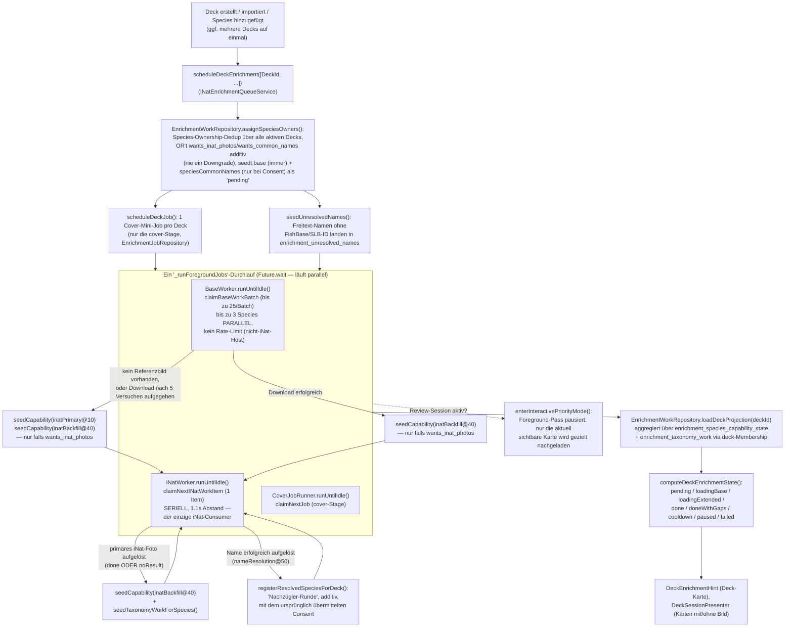
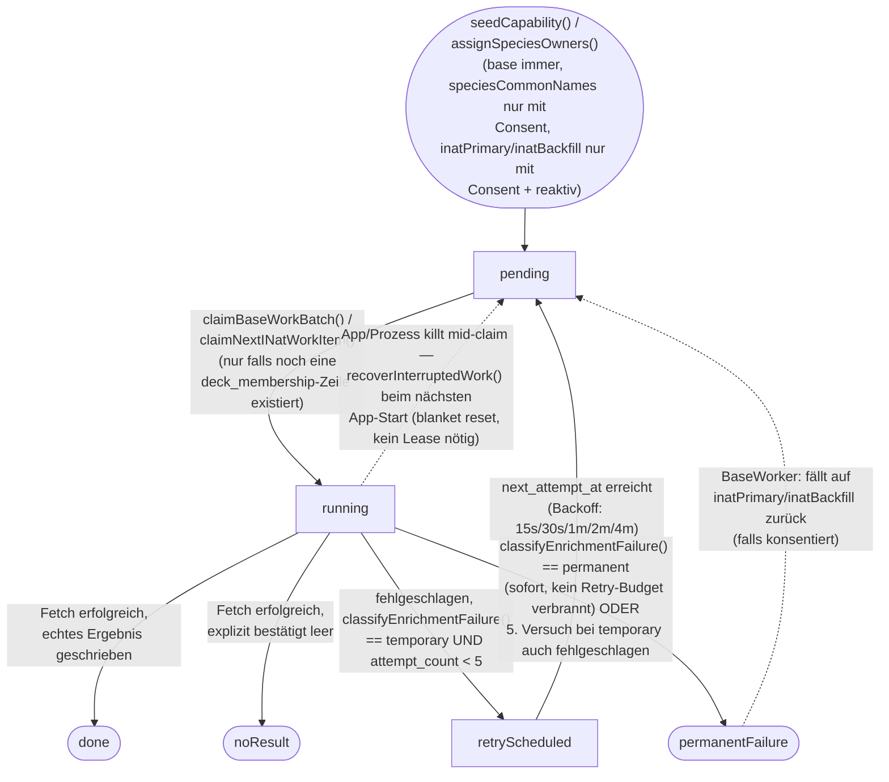

# iNaturalist-Enrichment — wie der Ablauf funktioniert

**Kategorie:** Architektur-Referenz (Ist-Zustand) · **Status:** Aktuell (Stand 2026-07-31)

Kurzreferenz für den aktuellen Enrichment-Ablauf: ein import-weites,
species-zentrisches Producer-Consumer-Modell mit zwei unabhängig laufenden
Workern über einer gemeinsamen, persistierten Prioritäts-Queue.

## Wozu

Nach Erstellen/Importieren eines Decks (oder Hinzufügen von Species zu einem
bestehenden Deck) reichert Discere jede Species im Hintergrund an:
Referenzbilder aus der ETL-Datenbank herunterladen, zusätzliche Fotos und
mehrsprachige Volksnamen von iNaturalist nachladen. Ziel: möglichst schnell
mindestens ein Bild pro Species, ohne die App zu blockieren.

## Ablauf

Die drei Worker (`BaseWorker`, `INatWorker`, `CoverJobRunner`) laufen **im
selben `Future.wait`-Durchlauf**, also echt nebenläufig zueinander.
Innerhalb von `BaseWorker` läuft zusätzlich echte Parallelität (`maxConcurrent
= 3`); `INatWorker` bleibt bewusst streng seriell, da es der einzige
Konsument des rate-limitierten iNat-Requestbudgets ist.

## Die zwei Worker im Detail

| Worker | Zieht aus | Capabilities | Nebenläufigkeit | Rate-Limit |
|---|---|---|---|---|
| `BaseWorker` | `claimBaseWorkBatch` (`enrichment_species_capability_state`, `capability = 'base'`) | `base` | bis zu 3 Species parallel, Batches à 25 | keiner (FishBase/SeaLifeBase, nicht iNat) |
| `INatWorker` | `claimNextINatWorkItem` (drei Quellen, niedrigster `priority_tier` gewinnt) | `inatPrimary` (10), `speciesCommonNames` (20), `taxonomyCommonNames` (30), `inatBackfill` (40), `nameResolution` (50) | streng seriell, 1 Item nach dem anderen | `1.1s` Abstand zwischen Claims |

`INatWorker` bündelt fünf Capabilities in **einer** Queue statt getrennter
Pfade — genau damit "ein rate-limitierter iNat-Konsument" eine echte Invariante
bleibt und nicht zwei unabhängige Pfade das Request-Budget gemeinsam
überziehen können. Die Namensauflösung (`nameResolution`) läuft deshalb an der
niedrigsten Prioritätsstufe in genau derselben Queue mit.

**Wichtige Vereinfachung:** `speciesCommonNames`/`taxonomyCommonNames` werden
immer als `'done'` markiert, sobald der Fetch terminal ist — es gibt keinen
Weg, von außen "echte Namen gefunden" von "bestätigt leer" zu unterscheiden
(`RuntimeCommonNameRepository` speichert den No-Result-Marker als ganz
normale Zeile in derselben Tabelle, die für "hat Namen" geprüft wird).
`inatBackfill` gate't die Deck-Bereitschaft nie (best-effort, "noch mehr
Fotos") — nur `base`/`inatPrimary` zählen für `imageStagesComplete`.

## Consent-Modell (additiv, nie ein Downgrade)

`includeINatPhotos`/`includeCommonNames` sind Parameter, die beim Schedulen
übergeben werden (keine persistente Deck-Einstellung). Sie werden **pro
Species** (nicht pro Deck) additiv verODERt in
`enrichment_species_work.wants_inat_photos`/`wants_common_names`:

- Eine Species, die einmal Consent von irgendeinem Deck bekommen hat, behält
  ihn — auch wenn ein anderes Deck, das dieselbe Species referenziert, ihn
  ablehnt (`assignSpeciesOwners`).
- `seedCapability` prüft `wants_inat_photos` selbst, bevor es `inatPrimary`/
  `inatBackfill` reaktiv anlegt — ein Species, die nur zu einem Deck ohne
  iNat-Consent gehört, bekommt dadurch **nie** ein iNat-Foto angefragt, egal
  was mit ihrem Referenzbild passiert.
- Ein Schedule-Aufruf für Deck B darf niemals stillschweigend Consent für ein
  anderes, gerade noch laufendes Deck A hochziehen, nur weil beide dieselbe
  Species teilen und A "der Einfachheit halber" mit übergeben wird (dedup,
  siehe unten) — dafür wird für alle nur mitgeschleppten Decks explizit
  `false` übergeben, statt das Feld auszulassen.

## Retry-/Resume-Strategie

Jede Capability-Zeile (`enrichment_species_capability_state`,
`enrichment_taxonomy_work`, `enrichment_unresolved_names`) durchläuft
denselben Zustandsautomaten — unabhängig davon, ob es eine Species-, eine
Taxonomie- oder eine Namensauflösungs-Zeile ist:

Wichtige Details dazu:

- **Klassifizierung vor Retry-Entscheidung** (`classifyEnrichmentFailure`,
  geteilt mit `CoverJobRunner`): `TimeoutException`/`http.ClientException`/
  ein retrybarer `HttpDownloadException` gelten als `temporary` (volles
  5-Versuche-Backoff-Budget); alles andere — inklusive eines nicht-retrybaren
  `HttpDownloadException` (z. B. 404) — gilt als `permanent` und gibt sofort
  auf, statt ~7 Minuten Backoff für einen Fehler zu verbrennen, der ohnehin
  nie erfolgreich gewesen wäre.
- **Crash-Recovery ist ein blanket reset, kein Lease-System:** Anders als
  `EnrichmentJobRepository`'s Job-Leases (mehrere mögliche Runner-Instanzen)
  gibt es pro Prozess genau einen `BaseWorker`/`INatWorker`. Jede beim letzten
  Absturz `running` gebliebene Zeile wird beim nächsten App-Start blanket auf
  `pending` zurückgesetzt (`recoverInterruptedWork()`, aufgerufen in
  `INatEnrichmentQueueService._initialize()`).
- **Claims respektieren cross-deck Löschungen:** `claimBaseWorkBatch`/
  `claimNextINatWorkItem` claimen eine Species-Zeile nur, wenn noch
  mindestens eine `enrichment_species_deck_membership`-Zeile für sie
  existiert. Wurde das letzte Deck, das eine Species referenziert hat,
  gelöscht (`releaseDeck`), bleibt ihre `enrichment_species_capability_state`-
  Zeile zwar als permanenter Dedup-Cache liegen (siehe unten), wird aber nie
  wieder geclaimt — kein verschwendeter Download/iNat-Request für ein Deck,
  das nicht mehr existiert.
- **Reaktive Folge-Arbeit statt Batch-weiter Gates:** `BaseWorker` seedet bei
  Fehlschlag/fehlendem Referenzbild `inatPrimary`+`inatBackfill`; `INatWorker`
  seedet nach einer aufgelösten `inatPrimary` zusätzlich `inatBackfill` +
  ggf. Taxonomie-Arbeit; ein aufgelöster Name registriert die Species
  additiv nach ("Nachzügler-Runde", `registerResolvedSpeciesForDeck`). Jede
  dieser Folge-Seeds ist idempotent (`ConflictAlgorithm.ignore`) und
  respektiert dieselbe Consent-Prüfung wie oben.
- **Host-Cooldown ist rein informativ:** `HostCooldownTracker` (gespeist von
  `LoggingHttpClient`s HTTP-Fehlerprotokoll) gate't keine Requests der Worker
  selbst — die eigentliche Drosselung passiert ausschließlich über die
  Backoff-Schritte pro Capability-Zeile oben. Der Tracker steuert nur die
  `DeckEnrichmentState.cooldown`-Anzeige und ob die Android-Foreground-
  Service-Notification aktiv bleiben soll.
- **Restart-Wunsch bei laufendem Durchlauf:** `_ensureForegroundRunner()`
  markiert einen Restart-Wunsch, wenn es während eines bereits laufenden
  `_runForegroundJobs()`-Durchlaufs aufgerufen wird, damit kurz hintereinander
  geschedulte Arbeit (z. B. zwei `scheduleDeckEnrichment`-Aufrufe) im selben
  Zyklus abgearbeitet wird, statt bis zum nächsten unabhängigen Ereignis
  (App-Resume, Netzwerkwechsel) liegen zu bleiben.
- **Begrenzte native DB-Opens:** `DatabaseHelper._openReferenceDb`/
  `_openUserDb` begrenzen den nativen Open-Call mit einem 8s-Timeout. sqflites
  natives Handle ist prozessweit pro Pfad; ein verklemmtes Handle würde einen
  `openDatabase()` sonst unbegrenzt hängen lassen und den gecachten
  Initialisierungs-`Future` für immer offenhalten, sodass jeder spätere Zugriff
  (Retry-Tap auf dem Bootstrap-Error-Screen, ein späterer Repository-Call) auf
  demselben toten Future wartet. Nach dem Timeout greift der `catchError`-Reset
  auf `_referenceInitialization`/`_userInitialization`, sodass der nächste
  Zugriff ein frischer Open-Versuch ist. `_refreshStateNow()` fängt auch
  `TimeoutException` (nicht nur `DatabaseException`), damit ein Timeout beim
  allerersten DB-Zugriff `_initialize()` nicht abbricht, bevor Lifecycle-
  Observer und Foreground-Runner aufgesetzt sind. `main.dart` schließt bei
  `AppLifecycleState.detached` (Engine-Teardown, z. B. wenn Android die Activity
  killt, während der Foreground-Service den Prozess am Leben hält) beide
  Datenbanken via `DatabaseHelper.close()`.
- **Membership überlebt die Fertigstellung:** `enrichment_species_deck_membership`
  ist die Speziesliste eines Decks und der Nenner, aus dem
  `DeckEnrichmentProjection` (`speciesCount`, `imageStagesComplete`, `done`,
  Progress, `isReady`) berechnet wird. Eine fertig-enrichte Species behält ihre
  Membership-Zeile also, solange das Deck sie referenziert — nur so bleibt das
  Deck als `done` berechenbar, und `loadDeckIdsUpdatedSince`'s Delta-Query sieht
  die finale Terminal-Änderung über den erhaltenen Join von selbst. Aufgeräumt
  werden Membership-Zeilen ausschließlich an den Lebenszyklus-Punkten, an denen
  sie wirklich obsolet werden: Species aus dem Deck entfernt (Drop-Loop in
  `assignSpeciesOwners`), Deck gelöscht (`releaseDeck`), verwaistes Deck beim
  Start (`_pruneOrphanedWork`). `enrichment_species_capability_state` bleibt
  darüber hinaus als prozessübergreifender Dedup-Cache bestehen (auch für
  Species in keinem Deck), damit erneutes Hinzufügen dieselbe Enrichment nicht
  wiederholt.

## Mehrere Decks gleichzeitig / Cross-Deck-Dedup

`scheduleDeckEnrichment()` nimmt weiterhin eine **Liste** von Deck-IDs
entgegen. Die Dedup-Logik greift import-weit über alle Decks eines Aufrufs hinweg:

**1. Species-Ownership** (`EnrichmentWorkRepository.assignSpeciesOwners`,
Tabelle `enrichment_species_work`) — verhindert, dass dieselbe Species von
mehreren gleichzeitig aktiven Decks unabhängig voneinander bei iNat
angefragt wird:
- Jede Species bekommt genau ein `owner_deck_id` (Tie-Break-Bookkeeping,
  keine exklusive Kontrolle) — **jedes** referenzierende Deck bekommt aber
  eine Zeile in `enrichment_species_deck_membership`, und die
  `enrichment_species_capability_state`-Zeilen sind ohnehin global pro
  Species, nicht pro Deck. Ein Deck muss also nicht "Owner" sein, um von
  bereits fertiger Arbeit für eine geteilte Species zu profitieren.
- Einmal vergebene Ownership bleibt stabil, solange der Owner noch unter den
  beteiligten Decks ist. Bereits aktive Decks werden bei einem neuen
  `scheduleDeckEnrichment`-Aufruf mit niedrigerer Priorität einbezogen — nur
  um ihre Species-Zuordnung zu schützen, ohne ihnen selbst neuen Consent zu
  gewähren (siehe Consent-Modell oben).
- `enrichment_species_capability_state` ist der **permanente** Dedup-Cache:
  wird eine Species aus jedem Deck entfernt (`releaseDeck`), bleibt diese
  Zeile bestehen — kommt die Species später in einem neuen Deck wieder vor,
  muss nichts doppelt geholt werden.
- Löscht das Deck, das gerade `owner_deck_id` einer geteilten Species ist,
  wird die Ownership auf ein verbleibendes Deck übertragen statt die
  Species-Zeile (und damit die Arbeit anderer Decks) einfach zu verwerfen.

**2. Taxonomie-Dedup** (`assignTaxonomyOwners`/`enrichment_taxonomy_work`,
Schlüssel `rank + taxon_id` bzw. `rank + scientific_name`) — Genus-/Familien-/
Ordnungs-/Klassen-Volksnamen werden einmal pro Taxon geholt, nicht einmal pro
Species darin, unabhängig davon, wie viele Decks/Species darauf verweisen.

## Runtime-Modell

- **Läuft komplett in der UI-Isolate**, kein separater Background-Isolate.
  `lib/app/background/inat_background_task.dart` existiert nur noch als
  No-Op-Callback für Workmanager-Wakeups von alten App-Versionen.
- Damit der Android-Prozess bei Bildschirm aus nicht vom OS beendet wird,
  hält `EnrichmentForegroundServiceKeeper` einen echten Android-Foreground-
  Service mit Notification am Laufen, solange Arbeit offen ist.
- Getriggert wird `_runForegroundJobs()` bei `scheduleDeckEnrichment()`, bei
  App-Start (`initialize()`) und bei jedem Wiedereintritt in den Vordergrund
  (`AppLifecycleState.resumed`) sowie bei Netzwerk-Wiederverbindung. Läuft
  nur, wenn online (`NetworkAvailability`).
- **Pausiert während einer aktiven Lern-Session:** `DeckPage` ruft beim
  Öffnen `enterInteractivePriorityMode()` auf — die drei Worker halten an,
  damit sie nicht mit dem gezielten Nachladen der gerade sichtbaren Karte
  um Bandbreite/DB-Zugriff konkurrieren.
- **Live-Fortschritt statt Sprung am Pass-Ende:** `BaseWorker`/`INatWorker`
  feuern einen `onProgress`-Callback nach *jeder einzelnen* verarbeiteten
  Species/Item, nicht erst wenn der komplette `_runForegroundJobs()`-Durchlauf
  fertig ist — sonst hätte die UI bei einem großen Batch (z. B. 20 Arten ×
  ~1.1s `INatWorker`-Taktung) minutenlang keinerlei sichtbare Bewegung.
  `INatEnrichmentQueueService._notifyProgress()` ruft dafür einfach
  `_refreshState()` auf — kein eigener Event-Bus nötig, da dieser Delta-Refresh
  selbst-koaleszierend ist (mehrere Aufrufe kollabieren zu einem Durchlauf,
  `notifyListeners()` feuert nur bei echter Änderung). `_refreshStateNow()`/
  `_syncCooldownStatus()` prüfen `_disposed` unmittelbar vor jedem
  `notifyListeners()` erneut (nicht nur am Funktionseinstieg), da zwischen
  Eintritt und `notifyListeners()` mehrere `await`-Punkte liegen (Delta-Queries,
  Projection-Reload, Foreground-Service-/Notification-Sync).

## Wichtige Komponenten

| Komponente | Pfad | Verantwortung |
|---|---|---|
| `INatEnrichmentQueueService` | `queue/service/` | Einstiegspunkt (`scheduleDeckEnrichment`), Lifecycle-/Foreground-Steuerung, leitet `DeckEnrichmentState`/`DeckEnrichmentInfo` für die UI ab |
| `BaseWorker` | `pipeline/service/` | Zieht `base`-Arbeit, echte Parallelität, kein Rate-Limit |
| `INatWorker` | `pipeline/service/` | Einziger rate-limitierter iNat-Konsument über fünf Capabilities inkl. Namensauflösung |
| `CoverJobRunner` | `queue/service/` | Führt den verbleibenden Cover-Mini-Job aus (Lease/Retry) |
| `EnrichmentJobRepository` | `queue/repository/` | Speichert nur noch die `cover`-Job-Zeilen (Lease, Retry, Payload) |
| `EnrichmentWorkRepository` | `pipeline/repository/` | Die eigentliche Queue: `enrichment_species_work`, `enrichment_species_capability_state`, `enrichment_taxonomy_work`, `enrichment_species_deck_membership`, `enrichment_unresolved_names` |
| `BaseImageEnrichmentService` / `INatPhotoEnrichmentService` / `SpeciesCommonNameEnrichmentService` / `TaxonomyCommonNameEnrichmentService` | `pipeline/service/` | Die eigentlichen Fetches pro Species/Taxon, aufgerufen von den beiden Workern |
| `INatNameResolutionService` | `pipeline/service/` | Löst Freitext-Namen gegen iNat auf (`ScientificNameResolutionPort`) |
| `EnrichmentForegroundServiceKeeper` | `queue/service/` | Android-Foreground-Service-Notification, solange Arbeit offen ist |
| `HostCooldownTracker` | `shared/service/` | Rein informativ: UI-Cooldown-Anzeige + Keepalive-Signal, gate't keine Requests |

## Wo die UI das liest

- `DeckEnrichmentHint` (Deck-Karte) zeigt Status-Icon + Text aus
  `DeckEnrichmentInfo`/`DeckEnrichmentState` (`pending`, `loadingBase`,
  `loadingExtended`, `done`, `doneWithGaps`, `cooldown`, `paused`, `failed`).
  Ein Fortschritts-Prozentsatz (`progressCompleted`/`progressTotal` aus
  `deriveDisplayedProgress`, gerundet) wird bewusst erst ab `loadingExtended`
  angezeigt — also erst sobald das Deck tatsächlich lernbar ist
  (`imageStagesComplete`, ein Bild-Ergebnis pro Species). Im `loadingBase`-
  Zustand (Deck noch nicht lernbar) gibt es nur den reinen Statustext, keine
  Zahl — eine Prozentangabe hätte sonst "80%" wie "80% lernbereit" lesen
  lassen, obwohl noch gar nichts davon stimmt. `progressTotal` ist dabei kein
  reiner Artenzähler, sondern eine Summe über mehrere Capability-Zähler
  (Basisbild pro Species + Common-Names-Consent-Species + Backfill-Species +
  Taxonomie-Einträge je Genus/Familie/… + optional 1 für den Cover-Job) —
  ein Deck mit 10 Arten kann je nach Consent/Taxonomie-Lage einen `total`
  deutlich über 10 haben.
- `DeckSessionPresenter.filterReviewableCards` entscheidet pro Flashcard: ist
  `DeckEnrichmentProjection.imageStagesComplete` (= `base`+`inatPrimary` für
  alle Species terminal) noch `false`, werden fällige Karten ohne lokales
  Bild versteckt; ist es `true`, werden alle fälligen Karten gezeigt, auch
  ohne Bild.
- **Bekannter, akzeptierter Trade-off:** `DeckEnrichmentInfo.lastCompletedAt`/
  `lastAttemptedAt` nutzt für Decks ohne echten Cover-Download (kein
  Cover-URL, also ein Cover-Job ohne `completed_at`) einen nur session-scoped
  In-Memory-Zeitstempel, da Species-/Taxonomie-Arbeit keine einzelne,
  deck-weite persistente Zeitstempel-Spalte mehr hat — nach einem App-Neustart
  zeigt so ein Deck "zuletzt abgeschlossen" ggf. nicht mehr an, auch wenn es in
  einer früheren Session fertig wurde. Ein Deck mit echtem Cover-Download
  (`completed_at` gesetzt) ist davon nicht betroffen.
- **Fehlt aktuell:** eine Deck-weite, persistente Aussage "für N Species
  wurde kein Foto gefunden" — dazu mehr in
  [GitHub Issue #53](https://github.com/discere-app/discere/issues/53).
