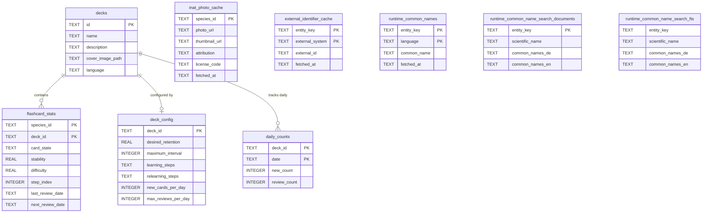

# Discere – Architecture Overview

## 1. What is Discere?

Discere is a **Flutter-based flashcard app** (Android + iOS) for learning biological species (primarily marine life). Users create or import decks of species, review flashcards using the FSRS 6 spaced-repetition algorithm, and track their learning progress. The app supports offline use, push notifications for due reviews, deck sharing via QR / JSON / text, and full DE/EN localization.

---

## 2. Architectural Style

> **Service-Oriented Layered Architecture with Provider-based DI**

The app uses a **3-layer service-repository architecture** wired via Provider-based dependency injection. It is not BLoC, not Clean Architecture, and not MVVM in a formal sense — though it shares traits with all three.

| Trait | In Discere |
|---|---|
| **Dependency Injection** | Manual constructor injection; wired in `lib/app/bootstrap_app.dart` and exposed via `MultiProvider`. |
| **State propagation** | `ChangeNotifier` + `Consumer` / `Provider.of`. Some services are `ChangeNotifier`, others are plain `Provider`. |
| **Data flow** | UI → Service → Repository → SQLite (via `DatabaseHelper`). |
| **Navigation** | Imperative `Navigator.push` with `MaterialPageRoute`. No declarative router. |
| **Separation of concerns** | Vertical separation by feature module (`catalog`, `enrichment`, `application`, `learning`). Module dependency rules are enforced by architecture tests. |

---

## 3. Layer Diagram

```
┌────────────────────────────────────────────────────────────┐
│                         UI Layer                           │
│  app/  •  catalog/  •  learning/  •  enrichment/           │
│  (StatefulWidget + FutureBuilder + Consumer)               │
└────────────────────────┬───────────────────────────────────┘
                         │  Provider.of / Consumer
┌────────────────────────▼───────────────────────────────────┐
│                     Service Layer                          │
│                                                            │
│  learning/         application/       enrichment/          │
│  DecksService      SpeciesMedia       EnrichmentService    │
│  FlashcardService  Service            INatEnrichment       │
│  FsrsService                          QueueService         │
│  DeckImport/                          SpeciesPhotoService  │
│  ExportService                        NameResolution       │
│                                                            │
│  shared/                                                   │
│  ImageService  NotificationService  LanguageService        │
│  UserPreferencesService  INaturalistService                │
└────────────────────────┬───────────────────────────────────┘
                         │  direct method calls
┌────────────────────────▼───────────────────────────────────┐
│                  Persistence Layer                         │
│                                                            │
│  DatabaseHelper (static, dual-DB singleton)                │
│  DeckRepository  •  FlashcardStatRepository                │
│  DeckConfigRepository  •  DailyCountRepository             │
│  SpeciesRepository  •  SearchRepository                    │
│  INatPhotoCacheRepository  •  ExternalIdCacheRepository    │
│  ExternalIdRepository  •  SourceRepository                 │
└────────────────────────┬───────────────────────────────────┘
                         │  sqflite
┌────────────────────────▼───────────────────────────────────┐
│                Data / Storage                              │
│                                                            │
│  discere_reference.db  (read-only, bundled asset)          │
│  discere_user.db       (read-write, user data)             │
│  SharedPreferences     (language, favorites, watchlist,    │
│                         global default retention)          │
│  Local filesystem      (cached images, deck covers)        │
└────────────────────────────────────────────────────────────┘
```

---

## 4. Module Structure

The app is split into feature modules with explicit dependency rules.

### `shared/`
Generic infrastructure and cross-cutting helpers. Must remain domain-agnostic.
- `DatabaseHelper`, `ImageService`, `LanguageService`, `UserPreferencesService`
- `INaturalistService`, `LoggingHttpClient`, `Logger`
- Generic UI primitives and utilities

### `catalog/`
The reference catalog domain: species, taxonomy, search, source metadata, catalog UI.
- `SpeciesRepository`, `SearchRepository`, `SourceRepository`
- `LocalSpeciesImageService`, `WatchlistService`
- Species detail, taxonomy detail, watchlist pages

### `enrichment/`
Runtime enrichment on top of the reference catalog.
- `EnrichmentService`, `INatEnrichmentQueueService`
- `SpeciesPhotoService`, `INatNameResolutionService`
- `INatPhotoCacheRepository`, `ExternalIdCacheRepository`, `ExternalIdRepository`

### `application/`
Orchestration for workflows spanning multiple modules.
- `SpeciesMediaService` — combines photo lookup (enrichment) + local image resolution (catalog)

### `learning/`
Decks, flashcards, spaced repetition, import/export, and review flows.
- `DecksService`, `FlashcardService`, `FsrsService`
- `DeckImportService`, `ImportExportService`, `RemoteDeckService`
- `DeckRepository`, `FlashcardStatRepository`, `DeckConfigRepository`, `DailyCountRepository`
- Deck list, review session, edit deck, deck settings pages

### `app/`
Composition root and shell. Wires all modules together via `bootstrap_app.dart`.
- `BootstrapApp`, `FlashcardApp`, `MainScreenPage`
- `SettingsPage`, `AboutPage`

### Module Dependency Rules

Enforced by `test/architecture/module_dependency_test.dart`:

```
shared      → (nothing)
catalog     → shared
enrichment  → catalog, shared
application → catalog, enrichment, shared
learning    → catalog, enrichment, application, shared
app         → shared, catalog, enrichment, application, learning
```

---

## 5. Database Schema

### 5.1 User DB (`discere_user.db`) — ERD



### 5.2 Reference DB (`discere_reference.db`) — Tables

| Table | Contents |
|---|---|
| `species` | Core species entities (ID, genus, binomial name, common names) |
| `genera` | Genus taxonomy |
| `families` | Family taxonomy |
| `orders` | Order taxonomy |
| `classes` | Class taxonomy |
| `pictures` | Bundled reference images with source/license metadata |
| `sources` | Upstream data source catalog (FishBase, SeaLifeBase, …) |
| `entity_external_ids` | ETL-produced offline mapping from Discere entity keys to external IDs (e.g. iNaturalist taxon IDs) |
| `metadata` | Technical key/value import metadata (ETL version, enrichment timestamps) |

---

## 6. FSRS 6 Algorithm

Discere implements **FSRS 6** (Free Spaced Repetition Scheduler v6), the sole scheduling algorithm.

### Card States

```
newCard → [initializeNextBatch] → learning
learning → [pass step] → learning | review
learning → [fail] → learning (reset steps)
review → [fail] → relearning
relearning → [pass step] → review
```

### Key Parameters (per deck, configurable)

| Parameter | Default | Description |
|---|---|---|
| `desiredRetention` | 0.9 (global) | Target recall probability |
| `maximumIntervalDays` | 36 500 | Hard cap on review interval |
| `learningSteps` | `[1m, 10m]` | Step durations for new cards |
| `relearningSteps` | `[10m]` | Step durations after failure |
| `newCardsPerDay` | 20 | Daily limit on newly initialized cards |
| `maxReviewsPerDay` | 200 | Daily cap on review-state cards (learning/relearning uncapped) |

### Global Default Retention

A global `defaultDesiredRetention` is stored in `SharedPreferences` (key: `default_desired_retention`, default 0.9) and editable on the Settings page. When a new deck is created or imported, a `deck_config` row is stamped immediately with the global default via the `DecksService.onDeckCreated` callback. Individual decks can override this via the Deck Settings page.

### Stability & Difficulty

FSRS 6 maintains two per-card parameters:
- **Stability** (`s`) — expected half-life of the memory trace; drives the next interval via `I = -log(R) / log(0.9) × s`
- **Difficulty** (`d`) — intrinsic hardness of the card; modulates stability updates on review

### 4.7 Enrichment Semantics

The post-import enrichment pipeline is intentionally **checkpointed and
terminal-state driven** — a species may only be marked complete for a stage
once it reached a real terminal outcome (data written successfully,
including the image actually landing on local storage, or an explicit
no-result marker), never just because a runner loop touched it once.

Full current-state walkthrough (stage list, terminal-state rule, runtime
model, components) moved to [`misc/enrichment.md`](./enrichment.md) — kept
out of this file so it doesn't drift out of sync as the pipeline keeps
changing.

### 4.8 Target Design: Import-Wide iNaturalist Enrichment

The current queue is still primarily **deck-centric**:
- one enrichment job per deck
- stage-local chunking per deck
- taxonomy common-name dedupe only within the current chunk

For large imports with overlapping decks this leaves substantial optimization
potential unused. The target design is therefore **import-wide and species-
centric**, while still projecting the results back onto individual decks.

Core modeling rules:
- species work is modeled primarily by `speciesId`
- iNaturalist dedupe happens only after a stable `taxon_id` exists
- taxonomy work is keyed preferably by `rank + taxon_id`, with
  `rank + scientific_name` only as a fallback before iNat resolution

Suggested import-wide collections / queues:

| Collection / Queue | Key | Purpose |
|---|---|---|
| `speciesWork` | `speciesId` | global species node with `deckIds`, `deckCount`, scientific-name candidates, per-stage states, and retry metadata |
| `taxonResolveMemo` | normalized scientific-name candidate | remembers successful/failed iNat taxon resolution attempts during the current import run |
| `taxonomyWork` | `rank + taxon_id` (fallback `rank + scientific_name`) | deduplicated taxonomy nodes for genus / family / order / class common names |
| `photoPrimaryQueue` | species priority score | fetch one good primary iNat image per species first |
| `speciesCommonNameQueue` | species priority score | fetch species-level common names only after taxon resolution is terminal |
| `taxonomyCommonNameQueue` | taxonomy priority score | fetch taxonomy-level common names only after the relevant species have stable iNat resolution |
| `photoBackfillQueue` | low-priority species score | optional enrichment of additional iNat images after primary coverage is done |

Recommended processing order:

```text
1. Build global speciesWork from the imported decks
2. Prioritize species by value (deckCount, missing primary image, known taxon_id, visible deck, retry state)
3. Run primary iNat photo coverage first
4. Run species common names second
5. Build deduplicated taxonomyWork only from successfully iNat-resolved species
6. Run taxonomy common names third
7. Run photo backfill last and at lower priority
```

This order intentionally follows a "good enough first" principle:
- first get one useful image per species
- then get species-level common names
- only afterwards spend requests on taxonomy names and photo backfill

Expected architectural benefits:
- overlapping species across multiple decks are resolved only once per import
  run instead of once per deck / per chunk
- higher-frequency species can be prioritized because one successful iNat
  result helps multiple decks immediately
- taxonomy common-name traffic can be deduplicated globally instead of only
  inside the current chunk
- backfill becomes an explicitly lower-priority luxury stage instead of an
  implicit continuation of the primary photo stage
- endpoint budgets (`taxa`, `observations`, `taxon_names.json`) can be managed
  more deliberately because the work graph is no longer hidden behind
  deck-local loops

State handling should remain explicit for both species and taxonomy nodes:
- `pending`
- `running`
- `done`
- `noResult`
- `retryScheduled`
- `permanentFailure`

This preserves the current "terminal outcome only" rule while moving the
enrichment orchestration from a deck-local queue model toward an import-wide
deduplicated work graph.

### 4.9 Incremental Migration Plan for the Current Codebase

The target design above should **not** be implemented as a single rewrite.
The current enrichment stack already contains valuable and battle-tested
pieces:
- `INatEnrichmentQueueService` knows how to coordinate foreground/background
  execution and user-visible state
- `EnrichmentJobRepository` already persists leases, retries, checkpoints, and
  stage states safely
- `EnrichmentService` already owns the iNaturalist-specific fetch logic and the
  terminal/no-result semantics

The safest migration path is therefore to keep these responsibilities in place
and change the **shape of the work graph** step by step.

#### Phase 1 — Reduce duplicate work inside the current deck job model

**Goal:** lower request volume without changing the top-level job model yet.

Changes:
- deduplicate taxonomy common-name work at least for the entire current deck
  job, not only for the current `names` chunk
- add run-local `taxonResolveMemo` so repeated scientific-name resolution
  attempts are reused during one import/enrichment run
- keep the current `EnrichmentJobRepository` stage model (`base`,
  `inatPrimary`, `names`, `inatBackfill`) unchanged

Primary files:
- `lib/enrichment/service/enrichment_job_executor.dart`
- `lib/enrichment/service/enrichment_service.dart`
- `lib/enrichment/repository/enrichment_job_repository.dart`

Expected value:
- immediate reduction of duplicate `taxa` and taxonomy common-name requests
- low behavioral risk because deck-local checkpoints and retries stay intact

#### Phase 2 — Introduce import-scoped species work assembly

**Goal:** stop treating overlapping decks as unrelated iNat work sources.

Changes:
- build an import-scoped `speciesWork` collection before deck jobs fan out
- key this collection by `speciesId`
- attach:
  - `deckIds`
  - `deckCount`
  - scientific-name candidates
  - known `taxon_id`
  - per-capability states (`photoPrimary`, `speciesNames`, `photoBackfill`)
- allow multiple deck jobs to reference the same species-work node instead of
  independently rediscovering it

Primary files:
- `lib/learning/service/deck_import_service.dart`
- `lib/enrichment/service/inat_enrichment_queue_service.dart`
- `lib/enrichment/repository/enrichment_job_repository.dart`

Expected value:
- overlapping species across multiple imported decks are resolved once instead
  of once per deck
- higher-value species can be prioritized based on `deckCount`

#### Phase 3 — Split species work from taxonomy work explicitly

**Goal:** prevent taxonomy common-name traffic from being coupled too early to
species chunk processing.

Changes:
- make species-level common names and taxonomy-level common names separate work
  streams
- only build `taxonomyWork` from species that have a stable iNat resolution
- key taxonomy work by:
  - preferred: `rank + taxon_id`
  - fallback: `rank + scientific_name`
- keep taxonomy nodes independent from the chunk that happened to discover
  them

Primary files:
- `lib/enrichment/service/enrichment_service.dart`
- `lib/enrichment/service/enrichment_job_executor.dart`
- `lib/enrichment/repository/runtime_common_name_repository.dart`
- `lib/catalog/repository/external_id_cache_repository.dart`

Expected value:
- much better dedupe for `genus / family / order / class`
- fewer false duplicates caused by same-name-but-different-taxon situations

#### Phase 4 — Re-prioritize the work graph around "good enough first"

**Goal:** get high-value results earlier and move expensive enrichment later.

Changes:
- prioritize `photoPrimaryQueue` before all other iNat work
- then run `speciesCommonNameQueue`
- then run `taxonomyCommonNameQueue`
- move `photoBackfillQueue` into a clearly lower-priority class
- use a score, not only `deckCount`, for species ordering:
  - number of affected decks
  - no image yet
  - known `taxon_id`
  - currently visible/foreground deck
  - current cooldown / recent failures

Primary files:
- `lib/enrichment/service/inat_enrichment_queue_service.dart`
- `lib/enrichment/service/enrichment_job_executor.dart`
- `lib/enrichment/repository/enrichment_job_repository.dart`

Expected value:
- one useful image per species arrives much earlier
- common user-visible progress improves before the expensive tail work begins

#### Phase 5 — Keep persistence, retries, diagnostics, and projection deck-aware

**Goal:** preserve robustness while the work model becomes more global.

Changes:
- keep retry/backoff and terminal outcome tracking explicit per work node
- continue projecting global enrichment results back onto per-deck UI state
- extend diagnostics to report:
  - how many species were shared across decks
  - how many requests were avoided through species/taxonomy dedupe
  - how many species became fully enriched vs. partially enriched

Primary files:
- `lib/shared/repository/local_diagnostics_repository.dart`
- `lib/shared/service/local_diagnostics.dart`
- `lib/enrichment/service/inat_enrichment_queue_service.dart`
- `lib/learning/decks/*`

Expected value:
- the refactor remains observable and debuggable
- deck-level UX stays understandable even when execution becomes import-wide

#### Practical recommendation

The most realistic sequence for the current codebase is:

```text
Phase 1  -> remove duplicate work inside the current model
Phase 2  -> introduce import-scoped speciesWork
Phase 3  -> separate taxonomyWork from species work
Phase 4  -> re-prioritize around primary photo coverage first
Phase 5  -> harden diagnostics and deck projection
```

This keeps the current queue/retry/checkpoint infrastructure alive while
moving progressively toward an import-wide deduplicated enrichment graph.

---

## 7. Key Runtime Flows

### 7.1 Dependency Wiring

`lib/app/bootstrap_app.dart` constructs all services and repositories, wires callback hooks (`onDeckCreated`, `onDeckDeleted`), and exposes everything via `MultiProvider`. Critical services are set up synchronously; deferred services (notifications, enrichment queue) are initialized after the first frame.

### 7.2 Review Session

1. `FlashcardService.getFlashCardsForReview(deckId)` queries `flashcard_stats` for due cards.
2. Daily review limit is applied: `learning`/`relearning` cards are always included; `review`-state cards are capped by `maxReviewsPerDay − todayReviewCount`.
3. `FlashcardService.reviewCard(speciesId, deckId, grade)` invokes `FsrsService.reviewCard()`, increments `daily_counts`, and reschedules push notifications. `grade` is one of four values: `Again` (forgot), `Hard` (difficult recall), `Good` (correct with effort), `Easy` (effortless recall).

### 7.3 Enrichment Queue

After a deck is created/imported/edited, `INatEnrichmentQueueService` schedules a checkpointed, per-stage enrichment run. See [`misc/enrichment.md`](./enrichment.md) for the full stage order, the terminal-state rule, and the runtime model (foreground-only, paused during active review sessions).

---

## 8. Testing

| Layer | Location | Tooling |
|---|---|---|
| Unit / service tests | `test/` | `flutter_test`, `mockito` |
| Architecture tests | `test/architecture/` | Custom import-path assertions |
| Integration tests | `integration_test/` | `flutter_test`, requires a device or emulator |

Mock files are generated by `mockito` via `build_runner` and co-located with the tests they serve (e.g. `test/service/mocks.dart`). After adding or changing `@GenerateMocks` annotations, re-run:

```sh
dart run build_runner build --delete-conflicting-outputs
```

CI runs on macOS via `.github/workflows/flutter_ci.yml`: `analyze` → unit tests → build APK + iOS.

---

## 9. Localization

ARB source files live in `lib/l10n/`. DE and EN are fully maintained; FR and ES exist as stubs.

| File | Language | Status |
|---|---|---|
| `app_de.arb` | German | Primary |
| `app_en.arb` | English | Primary |
| `app_fr.arb` | French | Stub |
| `app_es.arb` | Spanish | Stub |

Generated output (`lib/l10n/app_localizations*.dart`) is produced by `flutter gen-l10n` and must be re-run after any ARB change. The `LanguageService` (in `shared/`) exposes the active locale; UI code reads strings via `AppLocalizations.of(context)`.

---

## 10. Important Distinctions

| Pair | Distinction |
|---|---|
| `sources` vs `metadata` | `sources` describes a data source for UI/attribution; `metadata` tracks technical import/version state |
| `entity_external_ids` vs `external_identifier_cache` | `entity_external_ids` is ETL-produced and ships with the app; `external_identifier_cache` is discovered at runtime |
| `pictures` vs `inat_photo_cache` | `pictures` are bundled reference images from the ETL; `inat_photo_cache` contains runtime-fetched iNaturalist photos |
| `deck_config.desired_retention` vs `UserPreferencesService.defaultDesiredRetention` | Per-deck override stored in SQLite; global fallback stored in SharedPreferences |

---

## 11. Related Docs

- ETL overview: [`etl/README.md`](../etl/README.md)
- ETL ↔ Flutter integration: [`etl/FLUTTER_INTEGRATION.md`](../etl/FLUTTER_INTEGRATION.md)
- Architecture improvement tasks: [`misc/tasks/architecture-improvements.md`](./tasks/architecture-improvements.md)
- iNaturalist-Enrichment — wie der Ablauf funktioniert (Ist-Zustand, Diagramm): [`misc/enrichment.md`](./enrichment.md)
- iNaturalist Enrichment — Architektur & offene Probleme: [`misc/tasks/inaturalist-enrichment-strategy.md`](./tasks/inaturalist-enrichment-strategy.md)
