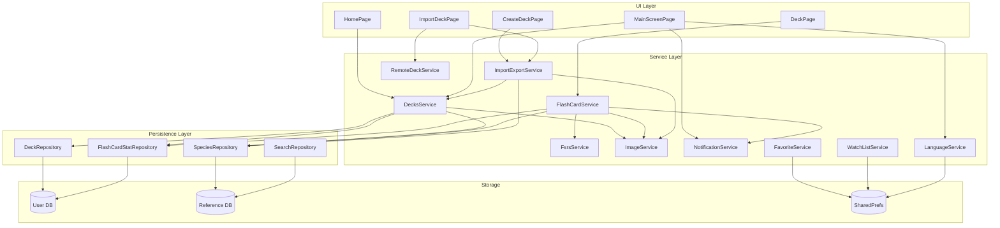

# Architecture Improvement Tasks

> Companion to [`misc/architecture-overview.md`](../architecture-overview.md).  
> Each task is self-contained, reviewable, and implementable independently.

---

## How to Read This Document

Each task includes:
- **What** — the problem and proposed change
- **Why** — the motivation and architectural benefit
- **Where** — affected files and layers
- **Risk / Effort / Value** — rated Low / Medium / High
- **Priority** — ordered from "do first" to "do later"

### Rating Legend

| Dimension | Low | Medium | High |
|---|---|---|---|
| **Risk** | No behavior change, safe refactor | Some behavior change, needs test update | Could break user data or core flows |
| **Effort** | < 2 hours | Half day to 1 day | 1–3 days |
| **Value** | Nice to have | Improves maintainability or DX | Unlocks future features or fixes real bugs |

---

## Priority Overview

| # | Task | Risk | Effort | Value | Priority |
|---|---|---|---|---|---|
| 1 | Remove dead code | Low | Low | Medium | 🟢 Do first |
| 2 | Fix notification rescheduling performance | Low | Low | High | 🟢 Do first |
| 3 | Fix `FutureBuilder` rebuild issues | Medium | Medium | High | 🟢 Do first |
| 4 | Introduce repository interfaces | Low | Medium | High | 🟡 Do second |
| 5 | Unify model serialization | Low | Medium | Medium | 🟡 Do second |
| 6 | Extract `DatabaseHelper` from static singleton | Medium | Medium | High | 🟡 Do second |
| 7 | Add typed routing (go_router) | Low | Medium | Medium | 🟡 Do second |
| 8 | Introduce a Result type for error handling | Low | Medium | Medium | 🔵 Do later |
| 9 | Extract notification scheduling from FlashCardService | Low | Low | Medium | 🔵 Do later |
| 10 | Feature-first module structure | Medium | High | Medium | 🔵 Do later |

---

## 🟢 Priority 1: Do First

These are low-risk, high-impact changes that should be done before any major refactoring.

---

### Task 1: Remove Dead Code

**Risk:** Low · **Effort:** Low · **Value:** Medium

#### What

The codebase contains several dead-code artifacts that add confusion and maintenance burden:

1. **`SpacedRepetitionService`** (`lib/service/learning/spaced_repetition_service.dart`, 88 lines)  
   This is the legacy SM-2 algorithm implementation. The app now uses `FsrsService` exclusively. `SpacedRepetitionService` is never instantiated anywhere — not in `main.dart`, not in tests. It still _implements_ `SpacedRepetitionAlgorithm`, which makes it look active.

2. **`lib/ui/widgets/`** — An empty directory. There's already a `components/` directory that serves the same purpose. The empty folder signals an incomplete or abandoned refactor.

3. **`lib/theme/app_theme.dart`** — This file is exactly 1 byte (empty). The actual theme lives in `ocean_theme/ocean_theme.dart`. The file is misleading.

4. **`lib/theme/marine_theme/`** — A second theme directory exists alongside `ocean_theme/`. Check whether it contains anything used; if not, remove it.

5. **`FlashCardStat.easeFactor`** field — This was an SM-2-specific field. FSRS uses `stability` and `difficulty` instead. The `easeFactor` column still exists in the DB schema and the model, but `FsrsService` never reads or writes it. It's effectively dead data.

#### Why

Dead code misleads developers into thinking features are active. It also increases the surface area for accidental coupling. The unused SM-2 implementation is particularly risky: a developer might accidentally wire it in instead of FSRS.

#### Where

| File | Action |
|---|---|
| `lib/service/learning/spaced_repetition_service.dart` | Delete file |
| `lib/ui/widgets/` | Delete empty directory |
| `lib/theme/app_theme.dart` | Delete file |
| `lib/theme/marine_theme/` | Inspect → delete if unused |
| `FlashCardStat.easeFactor` | Keep field for now (DB column exists), but add a `@Deprecated` annotation with a comment explaining it's SM-2 legacy |

#### How to Verify

- `flutter analyze` passes
- `flutter test` passes
- `grep -r "SpacedRepetitionService" lib/` returns zero results (already expected)
- `grep -r "marine_theme" lib/` returns zero results (expected)

---

### Task 2: Fix Notification Rescheduling Performance

**Risk:** Low · **Effort:** Low · **Value:** High

#### What

Currently, **every single card review** triggers a full notification reschedule:

```dart
// FlashCardService.reviewCard(), line 84
final allCards = await _flashCardStatRepository.getAllStats();
await notificationService.rescheduleAll(
  allCards: allCards,
  ...
);
```

This means:
1. `SELECT * FROM flashcard_stats` (could be hundreds/thousands of rows)
2. `cancelAll()` existing notifications
3. Loop through 14 days, re-query and re-schedule

In a typical review session of 20 cards, this happens **20 times**. That's 20× full DB scans and 20× notification cancel-and-recreate cycles — all on the main isolate.

#### Why

This is a real performance issue. On older devices with large decks (500+ cards), users may notice lag between card reviews. It also causes battery drain from repeated alarm scheduling.

#### Proposed Change

Defer notification rescheduling to **after the review session ends**, not after each individual card. Two approaches:

**Option A (simple):** Move the `rescheduleAll` call from `FlashCardService.reviewCard()` to `DeckPage.dispose()` or when the user navigates back from the review screen. This is the simplest change.

**Option B (robust):** Use a debounce mechanism in `FlashCardService`. After `reviewCard()` is called, start a 5-second timer. If another `reviewCard()` comes within 5 seconds, reset the timer. Only when the timer fires does `rescheduleAll()` execute.

**Recommendation:** Option A is sufficient for now. It's a 10-line change.

#### Where

| File | Change |
|---|---|
| `lib/service/learning/flashcard_service.dart` | Remove `rescheduleAll` from `reviewCard()`. Add a new public method `rescheduleNotifications()`. |
| `lib/ui/pages/deck_page.dart` | Call `_flashCardService.rescheduleNotifications()` in `dispose()` or via `WillPopScope`. |

#### How to Verify

- Review 5+ cards and confirm only 1 notification scheduling log line appears (at session end)
- `notification_test.dart` integration test still passes
- Manual: check that notifications are still correctly scheduled after a session

---

### Task 3: Fix `FutureBuilder` Rebuild Issues

**Risk:** Medium · **Effort:** Medium · **Value:** High

#### What

Multiple pages create `Future` objects **inside `build()`** or in ways that cause unnecessary re-execution:

**Problem 1 — `HomePage`:**
```dart
// home_page.dart line 12-16
return Consumer<DecksService>(
  builder: (context, decksService, child) {
    return DecksView(decksService.getAllDecks());  // ← new Future on every rebuild!
  },
);
```

Every time `DecksService.notifyListeners()` fires (after creating, deleting, or updating a deck), `Consumer` rebuilds, calling `getAllDecks()` again. This creates a **new `Future` instance** each time, which causes `FutureBuilder` inside `DecksView` to restart from `ConnectionState.waiting` — showing a loading spinner flash even though data hasn't changed.

**Problem 2 — `DeckCard._StatSubtitle` and `_ActionButton`:**
```dart
// deck_card.dart line 200-202
FutureBuilder<DeckStat>(
  future: Provider.of<FlashCardService>(context, listen: false)
      .getDeckStat(deckId),
```
These widgets create futures in `build()`. If the parent list rebuilds (e.g., from scrolling), each card re-queries the database.

**Problem 3 — `DeckPage`:**
```dart
// deck_page.dart line 175
_flashCards = snapshot.data ?? [];
```
Assigning to a field inside `FutureBuilder.builder` is a side-effect that shouldn't happen in `build()`.

#### Why

These are real UX bugs:
- **Spinner flashing:** Users see a brief loading spinner every time they return to the home page or create/delete a deck.
- **Unnecessary DB queries:** N cards × M rebuilds × 1 query each = performance waste.
- **State mutation in build:** Violates Flutter's build contract and can cause subtle bugs with hot-reload or key changes.

#### Proposed Change

**For `HomePage` / `DecksView`:**
Cache the `Future` in `initState()` and only refresh it explicitly:

```dart
class _HomePageState extends State<HomePage> {
  late Future<List<ViewDeck>> _decksFuture;
  
  @override
  void initState() {
    super.initState();
    _decksFuture = context.read<DecksService>().getAllDecks();
  }
  
  void _refresh() {
    setState(() {
      _decksFuture = context.read<DecksService>().getAllDecks();
    });
  }
}
```

Then listen to `DecksService` changes to trigger `_refresh()` instead of creating futures in `build()`.

**For `DeckCard` stat widgets:**
Either:
- Pre-fetch stats in the parent (`DecksView`) and pass them as constructor parameters (recommended), or
- Cache the future in `initState` of each card widget.

**For `DeckPage`:**
Move `_flashCards` assignment into the `Future.then()` callback in `_initializeFlashCards()`, keeping `build()` side-effect free.

#### Where

| File | Change |
|---|---|
| `lib/ui/pages/home_page.dart` | Convert to `StatefulWidget`, cache Future |
| `lib/ui/components/decks_view.dart` | Accept pre-loaded data or cached `Future` |
| `lib/ui/components/deck_card.dart` | Pre-fetch `DeckStat` in parent or cache in `initState` |
| `lib/ui/pages/deck_page.dart` | Remove side-effect from `build()` |

#### How to Verify

- Navigate back and forth between pages — no spinner flash
- Create/delete a deck — list updates without full reload indicator
- All integration tests pass
- Profile with Flutter DevTools: no duplicate `SELECT` queries during scrolling

---

## 🟡 Priority 2: Do Second

These improve the structural foundation and enable better testing.

---

### Task 4: Introduce Repository Interfaces

**Risk:** Low · **Effort:** Medium · **Value:** High

#### What

Currently, all services depend on **concrete repository classes**:

```dart
class DecksService extends ChangeNotifier {
  final DeckRepository _deckRepository;          // ← concrete
  final FlashCardStatRepository _flashCardStatRepository;  // ← concrete
  ...
}
```

This means unit-testing `DecksService` requires either:
- A real SQLite database (heavy, slow, requires `sqflite_ffi`)
- Mocking concrete classes with Mockito (requires `@GenerateMocks`, generates fragile mocks)

The `SpeciesRepository` already has a partial DI solution (accepts optional `Database`), but the pattern isn't consistent.

#### Why

Abstract repository interfaces enable:
1. **Fast, isolated unit tests** — Inject `FakeRepository` instead of real SQLite.
2. **Swappable implementations** — Could use Drift, Isar, or a remote API later without changing services.
3. **Explicit contracts** — Makes it clear what the service layer actually needs from persistence.

#### Proposed Change

For each repository, create an abstract interface:

```dart
// lib/persistence/deck_repository.dart
abstract class DeckRepositoryBase {
  Future<String> insertDeck(BaseDeck deck);
  Future<List<BaseDeck>> getAllDecks();
  Future<List<BaseDeck>> getDecksByIds(Set<String> deckIds);
  Future<void> delete(String deckId);
}

class DeckRepository implements DeckRepositoryBase {
  // ... existing implementation unchanged
}
```

Then update service constructors to accept the abstract type:

```dart
class DecksService extends ChangeNotifier {
  final DeckRepositoryBase _deckRepository;
  ...
}
```

#### Where

| File | Change |
|---|---|
| `lib/persistence/deck_repository.dart` | Extract `DeckRepositoryBase` interface |
| `lib/persistence/flash_card_stat_repository.dart` | Extract `FlashCardStatRepositoryBase` |
| `lib/persistence/species_repository.dart` | Extract `SpeciesRepositoryBase` |
| `lib/persistence/search_repository.dart` | Extract `SearchRepositoryBase` |
| `lib/persistence/source_repository.dart` | Extract `SourceRepositoryBase` |
| All services depending on repositories | Change constructor parameter types |
| `lib/main.dart` | No change needed (still instantiates concrete classes) |

#### How to Verify

- `flutter analyze` passes
- All existing tests pass
- Write one new unit test for `DecksService` using a fake in-memory repository

---

### Task 5: Unify Model Serialization

**Risk:** Low · **Effort:** Medium · **Value:** Medium

#### What

The codebase uses **three different serialization strategies:**

| Strategy | Where | Example |
|---|---|---|
| `json_serializable` + `build_runner` | `BaseDeck`, `CreateDeck`, `SearchResult` | `_$CreateDeckFromJson(json)` |
| Manual `_toMap` / `_fromMap` | `DeckRepository`, `FlashCardStatRepository` | `Map<String, dynamic>` conversion |
| Manual `fromMap` factories | `Picture.fromMap()`, `Species` constructor | Direct map access |

This creates confusion: when modifying a model, developers must know _which_ serialization approach applies and update accordingly. The `@JsonKey(includeToJson: false)` annotations on `BaseDeck` are also inconsistent — some fields are excluded from JSON but included in DB maps, and vice versa.

#### Why

- **Consistency** — One pattern to learn, one place to update.
- **Fewer bugs** — Manual `_toMap` methods can silently drift out of sync with the model.
- **Self-documenting** — `@JsonKey` annotations are explicit about what's serialized.

#### Proposed Change

Standardize on `json_serializable` for all JSON/API work. Keep manual `_toMap/_fromMap` in repositories (since they map to SQL column names, not JSON keys), but consider adding `@Column`-style comments or a thin mapping layer.

Concretely:
1. Add `@JsonSerializable()` to `Species`, `Classification`, `Picture` (if JSON export is needed).
2. Remove duplicated manual `toJson/fromJson` where `json_serializable` already handles it.
3. Document the convention: "JSON ↔ model uses `json_serializable`. SQL ↔ model uses manual repository mappers."

#### Where

| File | Change |
|---|---|
| `lib/model/biology/species.dart` | Add `@JsonSerializable()` if needed for export |
| `lib/model/biology/picture.dart` | Review `fromMap` — align with convention |
| `lib/persistence/*.dart` | Add code comments documenting the SQL-mapping convention |
| `README.md` or `CONTRIBUTING.md` | Document serialization convention |

#### How to Verify

- `flutter pub run build_runner build` succeeds
- All existing JSON import/export integration tests pass
- Export a deck → import it back → same data

---

### Task 6: Extract `DatabaseHelper` from Static Singleton

**Risk:** Medium · **Effort:** Medium · **Value:** High

#### What

`DatabaseHelper` is a fully static class with mutable static fields:

```dart
class DatabaseHelper {
  static Database? _referenceDb;
  static Database? _userDb;
  static Future<Database>? _referenceInitialization;
  static Future<Database>? _userInitialization;
  ...
}
```

Repositories access it via static getters: `DatabaseHelper.userDb`, `DatabaseHelper.referenceDb`.

#### Problems

1. **Global mutable state** — Multiple tests running in the same process share the same static fields. The `close()` and `deleteUserDatabase()` methods exist specifically to work around this.
2. **Implicit dependency** — Repositories don't declare a `DatabaseHelper` dependency in their constructor; they access it through a global static. This makes the dependency graph invisible.
3. **No interface** — Can't swap the implementation for tests without modifying the class itself.
4. **Concurrent test issues** — If integration tests run in parallel, they corrupt each other's DB state.

#### Why

Converting to an instance-based class with DI enables:
- True test isolation (each test gets its own DB)
- Explicit dependency graph (visible in constructors)
- Potential for multiple DB instances (e.g., migration testing)

#### Proposed Change

1. Convert `DatabaseHelper` to a regular class (non-static):
   ```dart
   class DatabaseHelper {
     Database? _referenceDb;
     Database? _userDb;
     
     Future<Database> get referenceDb async { ... }
     Future<Database> get userDb async { ... }
   }
   ```

2. Register it as a `Provider` in `main.dart`:
   ```dart
   final databaseHelper = DatabaseHelper();
   // Pass databaseHelper to repositories
   final deckRepository = DeckRepository(databaseHelper);
   ```

3. Update repositories to accept `DatabaseHelper` via constructor:
   ```dart
   class DeckRepository {
     final DatabaseHelper _dbHelper;
     DeckRepository(this._dbHelper);
     
     Future<Database> get _database async => _dbHelper.userDb;
   }
   ```

#### Risk Mitigation

This is a foundational refactor touching every repository. Do it in one focused PR with mechanical changes only — no business logic changes. Run the full integration test suite before and after.

#### Where

| File | Change |
|---|---|
| `lib/persistence/database_helper.dart` | Convert static → instance |
| `lib/persistence/deck_repository.dart` | Accept `DatabaseHelper` in constructor |
| `lib/persistence/flash_card_stat_repository.dart` | Accept `DatabaseHelper` in constructor |
| `lib/persistence/species_repository.dart` | Accept `DatabaseHelper` in constructor |
| `lib/persistence/search_repository.dart` | Accept `DatabaseHelper` in constructor |
| `lib/persistence/source_repository.dart` | Accept `DatabaseHelper` in constructor |
| `lib/main.dart` | Create `DatabaseHelper` instance, pass to repos |
| All integration tests (`integration_test/test_utils.dart`) | Update setup to use instance-based helper |

#### How to Verify

- Full integration test suite passes (all 18 tests)
- Unit tests pass
- `flutter analyze` passes
- Manual test: fresh install, create deck, review cards, restart app — data persists

---

### Task 7: Add Typed Routing (go_router)

**Risk:** Low · **Effort:** Medium · **Value:** Medium

#### What

All navigation is done with imperative `Navigator.push`:

```dart
Navigator.push(
  context,
  MaterialPageRoute(builder: (context) => const ImportDeckPage()),
);
```

This is used ~20 times across the codebase. There's no route naming, no type-safe parameter passing, and no deep-link support (except the manual notification handling in `MainScreenPage`).

#### Why

- **Type safety** — Route parameters (e.g., `deck`) are passed as constructor arguments. If a page's constructor changes, the code compiles but may crash at runtime if called from multiple places.
- **Deep linking** — The notification system already needs deep linking (hard-coded to `selectedIndex = 0`). A proper router makes this declarative.
- **Testability** — Named routes are easier to test in integration tests.
- **Web support** — If you ever add Flutter Web, go_router handles URL-based navigation.

#### Proposed Change

Add `go_router` and define all routes in a single route configuration:

```dart
final router = GoRouter(
  routes: [
    ShellRoute(
      builder: (context, state, child) => MainScreenPage(child: child),
      routes: [
        GoRoute(path: '/', builder: (_, __) => const HomePage()),
        GoRoute(path: '/favorites', builder: (_, __) => const FavoritesPage()),
        GoRoute(path: '/watchlist', builder: (_, __) => const WatchListPage()),
      ],
    ),
    GoRoute(
      path: '/deck/:id',
      builder: (_, state) => DeckPage(deckId: state.pathParameters['id']!),
    ),
    GoRoute(path: '/create', builder: (_, __) => const CreateDeckPage()),
    GoRoute(path: '/import', builder: (_, __) => const ImportDeckPage()),
    GoRoute(path: '/settings', builder: (_, __) => const SettingsPage()),
    // ...
  ],
);
```

#### Where

All `Navigator.push(...)` calls across `lib/ui/` (approximately 20 call sites).

#### How to Verify

- All navigation flows work manually
- All integration tests pass (may need to update navigation assertions)
- Deep link from notification navigates to correct page

---

## 🔵 Priority 3: Do Later

Lower urgency tasks that provide architectural cleanliness.

---

### Task 8: Introduce a Result Type for Error Handling

**Risk:** Low · **Effort:** Medium · **Value:** Medium

#### What

Error handling is currently inconsistent:

| Pattern | Where |
|---|---|
| Throws `AppException` subtypes | `RemoteDeckService` |
| Returns `null` on failure | `ImageService._downloadAndSaveImage()`, `SpeciesRepository.getSpeciesById()` |
| Silently swallows errors with `debugPrint` | `ImageService.deleteImage()`, `ImportExportService._finalizeImport()` |
| Re-throws with `rethrow` | `ImportExportService.importDeckFromGzip()` |
| Shows error in `FutureBuilder` | `DecksView`, `DeckPage` |
| Shows `SnackBar` in `catch` | `CreateDeckPage` |

There's no consistent pattern for how services report errors to the UI.

#### Why

- Users may see raw exception messages (e.g., `"Exception: Download failed (404)"`)
- Silent failures are hard to debug
- UI code must guess what exceptions a service might throw

#### Proposed Change

Introduce a `Result<T>` sealed class:

```dart
sealed class Result<T> {
  const Result();
}

class Success<T> extends Result<T> {
  final T data;
  const Success(this.data);
}

class Failure<T> extends Result<T> {
  final AppException error;
  const Failure(this.error);
}
```

Services return `Result<T>` instead of throwing. The UI can then pattern-match:

```dart
final result = await importExportService.importDeckFromJson(text);
switch (result) {
  case Success(): showSnackBar('Import successful');
  case Failure(error: var e): showSnackBar(e.message);
}
```

#### Where

Start with `RemoteDeckService` and `ImportExportService` as pilot services. Expand to others if the pattern proves useful.

#### How to Verify

- Simulated network failure → user sees localized error message, not stack trace
- All integration tests pass

---

### Task 9: Extract Notification Scheduling from FlashCardService

**Risk:** Low · **Effort:** Low · **Value:** Medium

#### What

`FlashCardService` currently has two responsibilities:
1. Managing flashcard review logic (scheduling, batching, querying)
2. Rescheduling push notifications after reviews

The notification logic includes hardcoded values:

```dart
preferredHour: 19,
preferredMinute: 0,
daysAhead: 14,
title: notificationTitle ?? 'Zeit zum Üben',  // ← German fallback!
```

This couples the flashcard domain to the notification domain. The `reviewCard()` method signature also requires `notificationTitle` and `notificationBodyBuilder` parameters, which leak UI concerns into a service-layer method.

#### Why

- **Single Responsibility** — Flashcard logic shouldn't know about notifications.
- **Localization bug** — The German fallback `'Zeit zum Üben'` will appear for English users if `notificationTitle` is not passed.
- **Testing** — Every test of `reviewCard()` must deal with or mock `NotificationService`.

#### Proposed Change

1. Remove notification logic from `FlashCardService.reviewCard()`.
2. Create a `ReviewSessionManager` or similar coordinator at the UI/service boundary that:
   - Calls `flashCardService.reviewCard()` for each card
   - After the session ends, calls `notificationService.rescheduleAll()`

This pairs naturally with Task 2 (moving rescheduling to session end).

#### Where

| File | Change |
|---|---|
| `lib/service/learning/flashcard_service.dart` | Remove `NotificationService` dependency, remove `notificationTitle` / `notificationBodyBuilder` params from `reviewCard()` |
| `lib/ui/pages/deck_page.dart` | Call `rescheduleAll()` in `dispose()` |
| `lib/main.dart` | Remove `NotificationService` from `FlashCardService` constructor |

#### How to Verify

- Review a deck → notifications are still scheduled after returning to home
- `flashcard_service` unit tests no longer need `NotificationService` mock

---

### Task 10: Feature-First Module Structure

**Risk:** Medium · **Effort:** High · **Value:** Medium

#### What

The current directory structure is **layer-first**:

```
lib/
  model/
    biology/
    learning/
    ...
  persistence/
    deck_repository.dart
    species_repository.dart
    ...
  service/
    common/
    learning/
  ui/
    pages/
    components/
```

This means files for a single feature (e.g., "deck management") are scattered across 4+ directories:
- `model/learning/base_deck.dart`
- `model/ui/view_deck.dart`
- `model/ui/create_deck.dart`
- `persistence/deck_repository.dart`
- `service/learning/decks_service.dart`
- `ui/pages/create_deck_page.dart`
- `ui/pages/edit_deck_page.dart`
- `ui/pages/deck_page.dart`
- `ui/components/deck_card.dart`
- `ui/components/decks_view.dart`

#### Why

As the app grows, layer-first becomes harder to navigate. Adding a new feature requires touching many unrelated directories. Feature-first grouping makes it clear what belongs together and makes features independently reviewable, testable, and (potentially) extractable as packages.

#### Proposed Change (Long-Term)

Transition to a **feature-first** structure:

```
lib/
  core/                    # Shared infrastructure
    database/
    theme/
    l10n/
    extensions/
    util/
  features/
    decks/                 # Everything about decks
      models/
      repositories/
      services/
      ui/
    flashcards/            # Review flow
      models/
      services/
      ui/
    species/               # Biology reference data
      models/
      repositories/
      services/
      ui/
    notifications/
    import_export/
    settings/
  shared/                  # Shared widgets, models
    models/
    widgets/
```

#### Risk Mitigation

This is a large refactor. Do it **incrementally**, one feature module at a time:
1. Start with the most self-contained feature (e.g., `notifications/`)
2. Move files, update imports
3. Run full test suite
4. Repeat for next feature

Use `dart fix` and IDE refactoring tools to update imports safely.

> **Recommendation:** Only do this if the team expects the app to grow significantly in scope. For the current size (~80 files), the layer-first structure is still manageable.

#### Where

All files in `lib/`.

#### How to Verify

- `flutter analyze` passes
- All tests pass
- No circular imports

---

## Appendix: Dependency Graph (Current)

The following shows how services depend on repositories and on each other:



This graph shows the key coupling issues:
- `FlashCardService` depends on 5 classes (including `NotificationService`)
- `ImportExportService` depends on `DecksService`, which depends on 4 repositories
- All repositories depend on the static `DatabaseHelper` (not shown)
